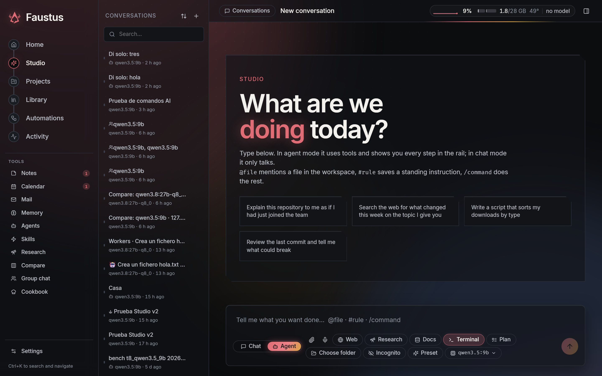
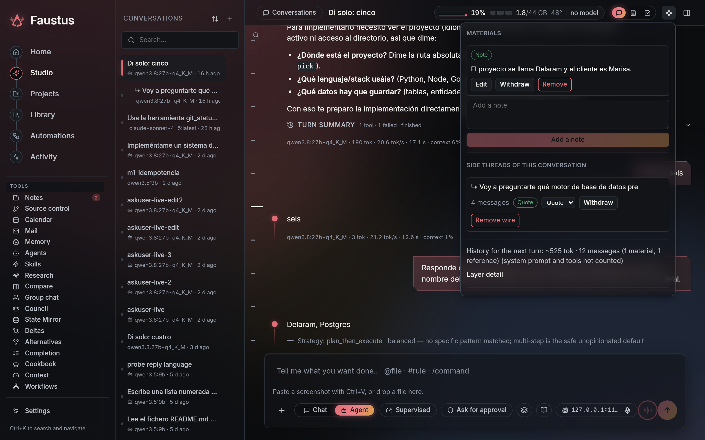
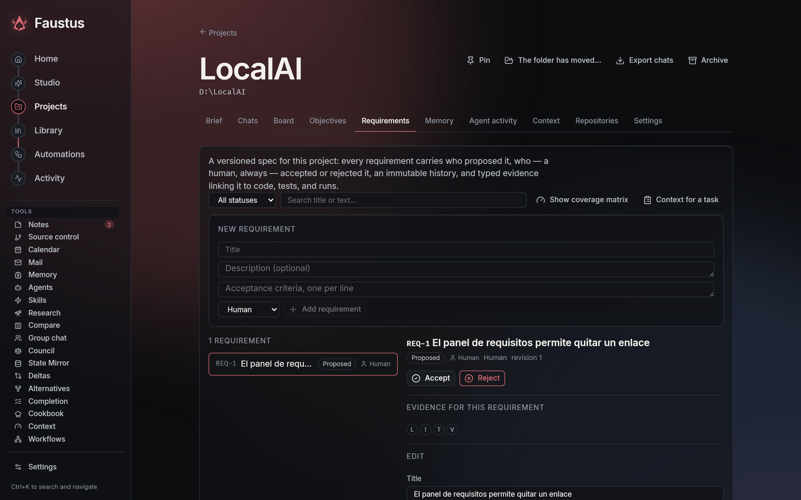
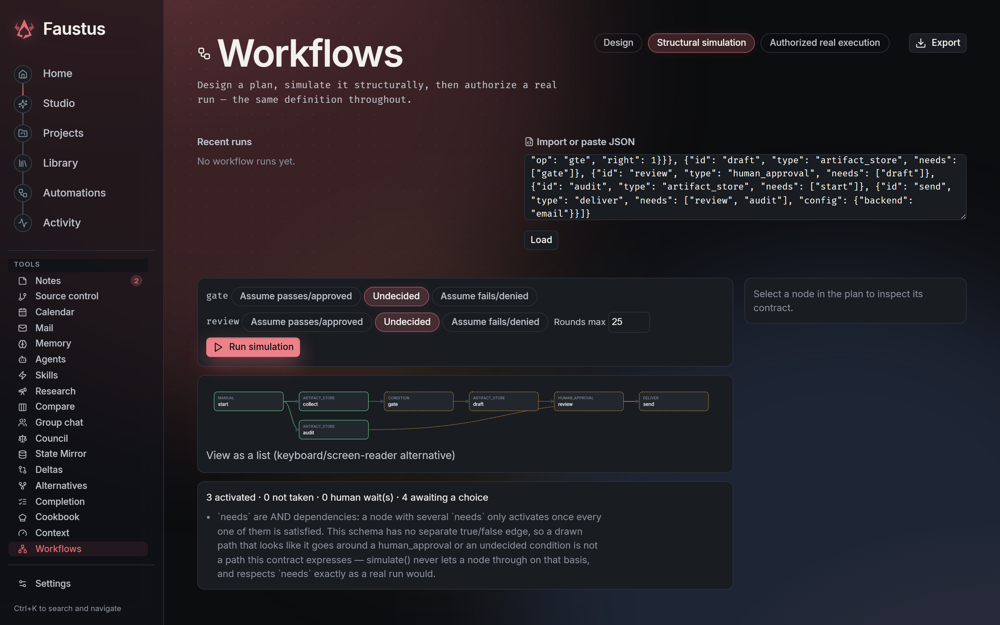
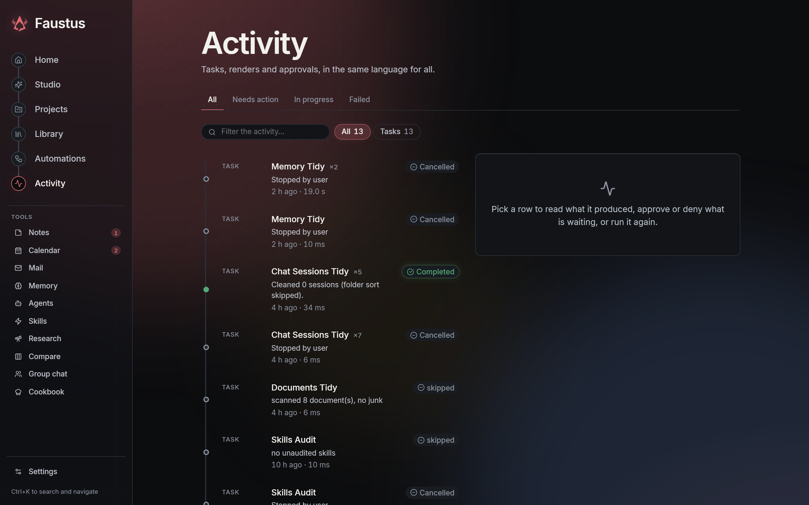
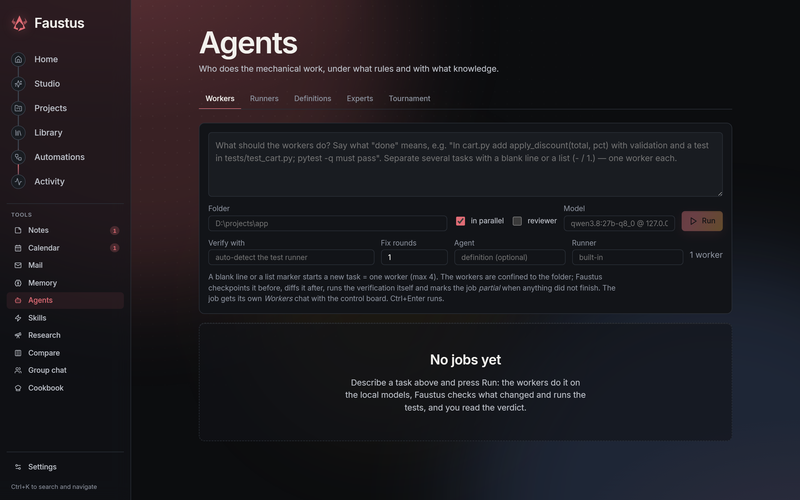
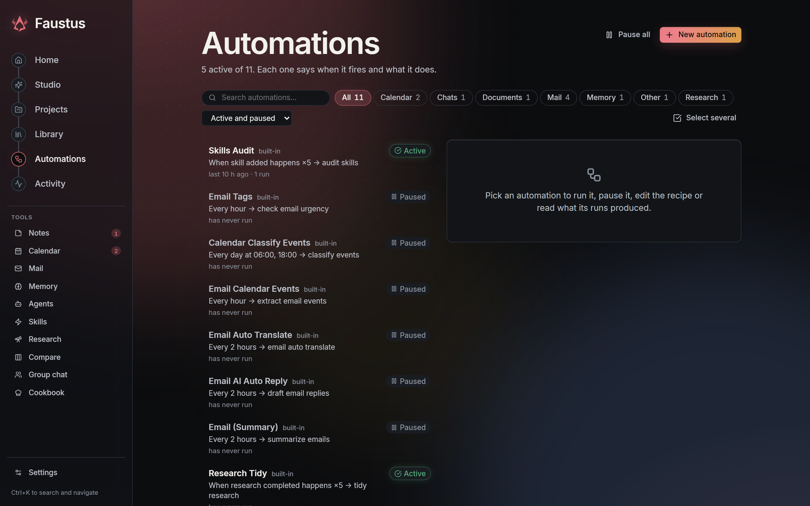

<p align="center">
  
</p>

<p align="center">Una estación de trabajo de IA autoalojada para modelos locales, proveedores en la nube y equipos de agentes.</p>

<p align="center">
  <a href="README.md">English</a> ·
  <a href="#inicio-rápido">Inicio rápido</a> ·
  <a href="#qué-puedes-hacer">Funciones</a> ·
  <a href="#arquitectura">Arquitectura</a> ·
  <a href="website/setup.md">Guía de instalación</a>
</p>




**Marketplace de plugins:** en Conectores puedes descargar los hoards con un botón o enlazar los que ya tienes. HoardLink es obligatorio y se descarga primero si falta. El catálogo se comparte con Faustus; las copias de código quedan en `plugins/<id>/repository/`, fuera de Git. Watch y Book siguen siendo independientes. [Uso y clonación para colaboradores](docs/api/plugin-marketplace.md).

## Verificación actual (8 de octubre de 2026)

Los arreglos de Studio, notas de revisión de Research y ámbito de temperatura de programación están integrados en el código; faltan la activación y una nueva evaluación Q4. Recuperación del formato de herramientas y checkpoints del Ágora siguen como candidatos aislados en revisión. Los checkpoints se probaron por HTTP, CLI, stdio MCP y el drawer en Chromium sin pantalla (español/inglés); las rutas y tests declarados no acreditan ejecución ni exclusividad. El lanzador CLI oficial revisado está instalado y conserva sesión, rutina y configuración MCP; usa un turno por la automatización horaria existente. Los límites de pipes retenidas por hijos y job objects de Windows quedan documentados como seguimiento. La caché de sondas lentas y el grounding de extracción con schemas requieren corrección antes de entregarse. Sin nuevo grado del modelo ni activación acreditada de las apps en producción. Véanse el [estado de verificación](FAUSTUS.md#276-evidencias-de-cierre-y-límites-de-la-verificación-07-10-2026) y las [puertas pendientes](OBJETIVOS.md).

## Qué es Faustus

Faustus reúne chat, agentes de programación, investigación, escritura, flujos de imagen y vídeo, voz y conocimiento de proyectos en un solo espacio. Es un fork personal de [Odysseus](https://github.com/odysseus-dev/odysseus), con backend Python/FastAPI e interfaz React/TypeScript.

Usa modelos locales mediante Ollama y servidores compatibles, o conecta APIs en la nube. Configura un orquestador y sus especialistas dentro de la conversación. Mantén juntos el trabajo, las fuentes, los archivos generados y el contexto del proyecto, y ve qué está ejecutándose sin adivinar si el modelo se ha congelado.

La idea que se repite es que el agente tiene que enseñar su trabajo: de qué contexto partió un turno, qué herramienta produjo qué evidencia, qué modelo respondió y cuánto costó, qué aprobación desbloqueó qué acción. Cada función descrita más abajo tiene un test que falla si eso deja de cumplirse, y una sección en [FAUSTUS.md](FAUSTUS.md) que explica por qué existe.

Local-first significa que eliges dónde se ejecuta la inferencia. Las APIs y los clientes oficiales autenticados consumen la facturación o cuota del proveedor; la inferencia local utiliza tu propio hardware. Elegir un proveedor remoto le envía el contexto necesario para esa petición.

### Valores predeterminados de generación local

Los turnos locales de agente usan temperatura `0.6` por defecto. El ajuste `agent_local_temperature_cap` vale `0.4` y se aplica cuando la intención de programar va acompañada de una señal con forma de código (por ejemplo, una ruta de código o una llamada a función) junto con una acción de programación; las peticiones de documentos, informes, poemas, capítulos, recetas o chats tienen prioridad. Crear u organizar un proyecto, archivos, documentos, páginas o menús no basta para activarlo. Las continuaciones breves y neutras como «sigue» heredan el límite a través de otras continuaciones seguidas solo si la última petición real en el historial de esa conversación es de programación; una nueva petición de documento, receta o chat cierra ese ámbito. La temperatura explícita del turno tiene prioridad y los endpoints remotos no cambian. El límite solo modifica la temperatura: no reduce el esfuerzo de razonamiento ni el presupuesto de tokens.

La familia Hoard conectada incluye las herramientas MCP locales de [CookHoard](https://github.com/Luissalet/CookHoard) y [GamerHoard](https://github.com/Luissalet/GamerHoard), [HomeHoard](https://github.com/Luissalet/HomeHoard) para encontrar objetos a partir de una copia local del inventario sin fotos, y [Mercator's Hoard](https://github.com/Luissalet/Mercators-Hoard) como panel local de uso y ventas. El inventario web de HomeHoard actualiza su copia para Faustus tras la primera conexión manual mientras funciona el puente localhost; la copia móvil se transfiere manualmente. Las funciones de audio de Scribe viven en Funes.

## Inicio rápido

Instala Docker y Docker Compose y, a continuación:

```bash
git clone https://github.com/Luissalet/Faustus.git
cd Faustus
cp .env.example .env
docker compose up -d --build
```

En PowerShell, usa `Copy-Item .env.example .env` en lugar de `cp`.

Abre **http://localhost:7000**. La contraseña inicial de administrador aparece en `docker compose logs odysseus`. Compose incluye los servicios de búsqueda y almacenamiento vectorial; no descarga un modelo de lenguaje por ti.

1. Conecta tu servidor de modelos desde Ajustes o Cookbook. Si Ollama está en el equipo anfitrión de Docker, configura su dirección accesible siguiendo la [guía de instalación](website/setup.md).
2. Crea un proyecto y adjunta los archivos, documentos o fuentes que debe conocer.
3. Inicia una conversación. Elige **Chat** para conversar o **Agente** para herramientas y acciones.
4. Consulta **Actividad** para seguir conversaciones, flujos de trabajo, renders y aprobaciones.
5. Añade motores de imagen/vídeo, servicios de voz o clientes de agentes externos cuando los necesites.

Instalación nativa, Windows/macOS, GPU, HTTPS y configuración: [guía de instalación](website/setup.md). Conserva tu carpeta `data/` y haz una copia de seguridad antes de actualizar.

## Qué puedes hacer

### Lanzadores de escritorio y web para Windows

Los lanzadores están dentro del repositorio y resuelven las rutas desde la carpeta del proyecto:

| Lanzador | Acción |
| --- | --- |
| `Start-Faustus-Desktop.bat` | Abrir una ventana Electron nativa con minimizar, maximizar/restaurar, pantalla completa y cierre integrados en el tema. Registra los enlaces `faustus://`, así que otra app puede abrir en ella un chat, un documento o una tarjeta del tablero (`faustus://studio?s=<id>`); los enlaces sólo llegan a páginas de lectura y nunca envían nada. |
| `Start-Faustus.bat` | Arrancar Faustus y abrir la interfaz web en el navegador. |
| `Stop-Faustus.bat` | Detener el servidor gestionado por estos lanzadores. |
| `Restart-Faustus.bat` | Reiniciar ese servidor y abrir la interfaz web. |

La primera instalación necesita Python y Node.js. Los lanzadores preparan las dependencias que falten, reconstruyen los assets de Studio cuando están desactualizados e instalan el runtime de escritorio fijado si es necesario. `Start-Faustus.ps1 -NoBrowser` arranca el modo web sin abrir pestaña; `-Port 7001` permite elegir otro puerto.

Cerrar la ventana de escritorio detiene el backend **sólo si esa ventana lo arrancó**. Un servidor web ya en marcha se reutiliza y sigue funcionando al cerrar la ventana. Se comprueba la propiedad del proceso; no se detienen otros procesos Python ni servidores de modelos externos ajenos. La autenticación de escritorio es independiente de la del navegador, así que hay que iniciar sesión una vez en la ventana.

Las tareas programadas necesitan un servidor Faustus en marcha y el ordenador despierto. Usa el modo web para mantener el backend funcionando tras cerrar las pestañas del navegador; cerrar una ventana de escritorio que sea la propietaria también detiene la programación. En un chat Agente, pide una recurrencia en español o inglés, indica hora y zona horaria y gestiona la tarea guardada en **Automatizaciones**. Las tareas recurrentes admiten zonas horarias IANA y cambios de horario de verano; las tareas antiguas sin zona conservan su comportamiento en UTC.

### Instalar Faustus en el móvil

Studio se instala como app independiente (PWA) desde el propio navegador, sin tienda ni compilación. En navegadores Chromium (escritorio o Android), **Ajustes → Este dispositivo** ofrece «Instalar Faustus» en cuanto el navegador lo permite; en Safari de iOS, que nunca lo ofrece por sí solo, la misma pantalla explica el paso manual (Compartir → Añadir a pantalla de inicio). Una vez instalada abre a pantalla completa con su icono, mantiene la interfaz operativa sin red y recibe notificaciones del sistema —turno terminado, aprobación pendiente, recordatorio— aunque la app esté cerrada, mediante Web Push estándar (VAPID + `aes128gcm` implementados sobre `cryptography`, sin servicios de mensajería de terceros). Para llegar a Faustus fuera de tu red el servidor tiene que estar expuesto por HTTPS (una VPN o un túnel), cosa que «Este dispositivo» recuerda pero no configura. Por debajo de 767 px la navegación pasa a una barra inferior de cinco pestañas (Inicio, Studio, Calendario, Notas, Ajustes). [API móvil](docs/api/mobile.md) · [notas de la vista móvil](docs/ui/pwa.md).

### Herramientas creativas dentro de la conversación

- **Señalar para editar:** selecciona un punto en una captura del navegador y describe el cambio. Se añaden al borrador una captura anotada y la procedencia de la captura, sin enviarla automáticamente. El agente debe inspeccionar la página actual y el proyecto; las coordenadas de la captura no son ubicaciones inventadas en el código fuente.
- **Edita una imagen adjunta pidiéndolo.** Arrastra una foto al chat y di qué cambiar («ponle un sombrero», «pásala a anime», «armoniza este recorte»): el ID de galería llega incluso a un modelo sin visión, `edit_image` se ofrece desde el principio, el render se hace en el estudio de imagen seleccionado tras aprobarlo y el resultado se ve en directo, sigue al reabrir y enlaza a su URL real de la galería. Una ronda posterior nunca repite la misma edición y una respuesta que afirma una edición que ninguna herramienta hizo se sustituye por una veraz. `image_job` consulta, recoge o cancela una petición (cancelar para solo ese render, nunca otro trabajo de la misma GPU), y los renders que un reinicio dejó a medias se recogen en la galería al volver a arrancar. Con el estudio seleccionado, `edit_image` también amplía (x2 o x4, un modelo Real-ESRGAN) y quita el fondo (BiRefNet, un PNG que conserva la transparencia) allí; ampliar un recorte lo deja recortado.
- **Referencias visuales de proyecto:** guarda `@referencias` con nombre como enlaces de contexto de proyecto, distingue sujeto, estilo y composición, y adjúntalas explícitamente desde el selector. Quitar el enlace de una referencia no elimina su imagen de la galería.
- **Aprender un estilo:** extrae reglas de estilo editables a partir de ejemplos en TXT/Markdown usando el modelo elegido, compara la respuesta base con la respuesta con estilo y guarda y selecciona un preset. La comparación hace dos llamadas al modelo usando la conexión seleccionada.
- **Vídeo local:** transcribe con un modelo Whisper ya instalado, edita o traduce manualmente los segmentos con marca de tiempo, exporta SRT/VTT, y renderiza narración usando las voces de Windows en inglés o español instaladas. Sin API en la nube ni descargas automáticas de modelos. Las entradas están acotadas a 64 MB, 3 minutos y 1080p; se requiere FFmpeg/FFprobe. Esto es narración local práctica, no clonación de voz ni sincronización labial. La exportación narrada sustituye el audio original.
- **Notas de reunión:** graba o sube un archivo de audio y recibe notas en Markdown — resumen, decisiones, tareas (responsable/fecha límite cuando se mencionan), preguntas abiertas y la transcripción completa con marcas de tiempo — mediante un trabajo en segundo plano que fragmenta las grabaciones largas, transcribe cada fragmento con el motor de voz configurado, y hace una pasada con un modelo local para redactar las notas. Si esa pasada no está disponible, la transcripción se guarda igualmente con un aviso en lugar de perderse. Está en Biblioteca → Meetings.

### Chat y panel de trabajo persistente

- Alternar entre modelos locales y de API; conectar OpenAI, Claude, Gemini y OpenRouter con configuración guiada y prueba de conexión. Las llamadas a OpenRouter informan de su coste real, las preferencias por endpoint (recopilación de datos, orden de proveedores, búsqueda web solo cuando se pide) son explícitas, y un perfil de privacidad solo local rechaza las llamadas salientes en lugar de degradarlas en silencio.
- Un interruptor en Settings → Default AI (también en Settings → Local models) elige si el modelo por defecto se carga al arrancar y se mantiene cargado — cambia en vivo, sin reiniciar: encendido lo carga ya, apagado lo libera al momento (VRAM libre en segundos, nunca a mitad de un turno de chat). Funciona con los dos backends locales: mantenido en Ollama vía `keep_alive`, o un `llama-server` de llama.cpp gestionado que se arranca y se exime de su propio temporizador de inactividad mientras el interruptor está encendido. Cada lista de modelos (Default AI, Local models, el selector del chat) muestra quién lo sirve de verdad — Ollama, llama.cpp o una API remota — detectado una vez y compartido en todos lados.
- **Quién ocupa las GPU**: el indicador de uso de la cabecera nombra el modelo más grande en memoria con lo que ocupa (y `+N` por los demás); su panel lista cada modelo —de Ollama o de llama.cpp— con quién lo cargó (Faustus, uno de sus motores, Ollama o el script o programa que lo arrancó), la memoria que ocupa medida por proceso y cuánto hay en cada tarjeta, y después los demás procesos que ocupan memoria de GPU. [model_residency.py](src/model_residency.py).
- Decodificación restringida en los dos backends locales: cuando una pasada interna pide un objeto JSON, el esquema viaja como gramática — `format` en Ollama nativo, `response_format` en llama-server — y el modelo no puede emitir un token que lo rompa. Forzar JSON a secas no basta: devuelve JSON válido con un valor fuera del conjunto permitido.
- Cuando el motor que sirve el modelo de chat por defecto está parado, Settings → Local models lo dice encima de la lista de motores y ofrece un botón que lo arranca, en vez de dejar que el siguiente chat falle sin nada que hacer.
- **Un turno cortado sigue respondiendo.** Cuando el cortacircuitos termina una ejecución por repetirse sin avanzar, todo lo necesario para responder ya está en la conversación, así que una última pasada sin herramientas la escribe — en la ruta que estaba respondiendo de verdad, para que el coste caiga donde cayó el trabajo. Un turno detenido nunca es una respuesta en blanco.
- Preguntar no se trata como escaquearse: con un workspace abierto, una petición de que te expliquen algo se responde con prosa sin devolverla exigiendo una llamada a herramienta, y el recordatorio permanente de idioma se coloca de forma que lo último que lee el modelo sea el paso que acaban de darle.
- Pegar capturas directamente con **Ctrl+V**, adjuntar archivos y mencionar ficheros del workspace.
- Navegar por chats largos con la barra de mensajes: previsualización al pasar el cursor, clic o arrastre para saltar, o usar flechas, Inicio/Fin y RePág/AvPág. Consultar mensajes anteriores pausa el seguimiento automático del flujo.
- Leer el Markdown generado junto al chat, editarlo y guardarlo con detección de conflictos. Los borradores sin guardar pertenecen a su conversación y sobreviven a la navegación entre paneles. Los tres diseños de Studio (conversación, documento, revisión) comparten una misma sesión de documento, de modo que una selección en el documento se convierte en un cable de contexto en el redactor, y una sugerencia del agente aterriza en su anclaje, nunca en la primera línea que coincida.
- Mantener archivos, resultados generados, fuentes, contexto del proyecto, actividad de agentes y capturas del navegador en un panel lateral redimensionable.
- Cambiar a otra conversación mientras el servidor sigue ejecutando el turno actual. Ver la posición en cola, la actividad en curso, el uso de herramientas y las solicitudes de permiso; reconectar con el trabajo existente. Una tarjeta de aprobación cuyo permiso murió con un reinicio lo indica, en lugar de ofrecer botones muertos.
- Cada turno muestra la estrategia que eligió el agente (edición directa, planificar y ejecutar, investigación, revisión especializada, explorar alternativas) y por qué; un turno que merece repetirse puede guardarse como receta con sus entradas reales.
- **Ve cada llamada al modelo que hizo una sesión** — un panel «Model calls» muestra la petición exacta enviada (secretos tapados), la respuesta ensamblada, las llamadas a herramientas, los tiempos y los errores de cada llamada, y cualquier llamada registrada puede reenviarse sin cambios a otro modelo para comparar respuestas lado a lado.
- Buscar y navegar con **Ctrl+K**: desde el segundo carácter busca también en todo lo tuyo a la vez (chats, cerebro, notas, documentos, imágenes, skills y tareas del tablero), mezclado por relevancia, con una fila de filtros por tipo; cada resultado abre su pantalla ([unified_search.py](src/unified_search.py)). Usar español o inglés, temas, controles de densidad, tamaño de texto ajustable y movimiento reducido.

- Elige un **modo de comportamiento**: una postura conversacional con nombre (adversarial, socrático, escueto, mentor, equipo rojo, observador externo, editor, o uno escrito por ti) que cambia cómo argumenta Faustus, nunca lo que puede hacer; entra en el prompt después del preset de tarea y estrictamente antes de la política de contenido no fiable, también en modo agente e Incógnito ([API de modos](docs/api/behavior_modes.md)).
- Enchufa **tus propias apps locales como plugins**: cada conector es ya un manifiesto suyo (`plugins/<id>/plugin.json`), y una aplicación puede traer su propio `faustus-plugin.json` para que se ofrezca en cuanto se la ve, con el formulario relleno, sin mandar un parche a Faustus ([Plugins](docs/api/plugins.md)). Faustus puede listarlos, levantar uno que esté caído desde un perfil de arranque que hayas guardado, y enseñártelo cuando se lo pidas — una app que ya responde se adopta en vez de reiniciarse, y nada le permite pararlas. Nombrar una de tus apps en una petición trae estas herramientas consigo, y una app que arranca en otra dirección de la que dice su conexión se nombra como tal en vez de esperarla. Lo que pides con todas las letras («arranca Jobhunter», «¿qué recuerdas de mí?», «recuerda que los lunes trabajo desde casa», «apúntame el dentista el martes a las cinco», «escríbeme un correo para mi casero») se ejecuta sin tarjeta de aprobación, igual que abrir un enlace que devolvió la propia búsqueda cuando pediste buscar algo; lo que el modelo decide por su cuenta tras leer contenido no fiable sigue preguntando, y con texto web en el turno, escribir un documento, un recuerdo o un evento vuelve a preguntar. Igual con el trabajo dentro de la carpeta de un proyecto: pasar sus tests, un comando que escribes entre comillas invertidas, mirar sus ficheros con el shell, un análisis de datos en Python que se demuestra que no sale de la carpeta, ejecutar el script que le pediste escribir y probar cuando su código se demuestra que no sale de la carpeta, y escribir el fichero que nombras; instalar paquetes, capturar la pantalla o código que podría salir de la carpeta sigue preguntando. Una pantalla `/connectors` sobre el gestor MCP existente con estados reales que separan «la app está apagada» de «el adaptador falló el handshake», perfiles de arranque configurados por el usuario (argv estructurado, sin shell, readiness, idempotentes) y una lista de conectores permitidos por chat / proyecto / tarea programada que el despachador de herramientas hace cumplir en vez de solo ocultar ([API de conectores](docs/api/connectors.md), [selección de herramientas](docs/api/tool_selection.md), [receta de candidaturas](docs/api/candidature_recipe.md)).
- **Diez apps tuyas más como plugins**: Cassandra's (observabilidad del stack local entero: qué servicio está arriba, qué se cayó y cuándo, qué más cambió en ese minuto, qué decían los logs, qué hacían las GPUs, reinicios opcionales, y tus webs públicas: si responden, días de certificado, DNS y caducidad del dominio), Nightingale's (un banco de trabajo de datos: metes ficheros, carpetas o URLs, los limpias con pasos versionados que se pueden deshacer y repetir, los compruebas con reglas de calidad, haces gráficos y paneles, entrenas modelos rápidos y previsiones), Echo's (el historial de tu portapapeles, buscable, con las contraseñas y tokens ocultos antes de guardarse; el asistente también puede ponerte texto en el portapapeles), Hypatia's (tarjetas de repaso espaciado que el asistente escribe de lo que lees y con las que te examina en el chat), Vulcan's (tus modelos imprimibles: medidas, miniaturas, duplicados y fichas de tienda que escribe el asistente; además ordena una carpeta en una carpeta por grupo a partir de una lista que pegas, con vista previa, sin sobrescribir y con deshacer, y escribe todas las fichas de una vez), Ledger's (dinero de casa), Links (guardar para luego con el texto extraído), People's (quién es quién, último contacto, cumpleaños), Argus's (memoria de pantalla privada con OCR local) y Borges's (tus documentos indexados con embeddings locales + BM25, responde con fichero y página). Las herramientas de audio de Scribe forman parte de Funes, no de una app plugin separada. Cada app independiente trae su `faustus-plugin.json`, se reconoce en su puerto y se ha usado de punta a punta desde un chat con un 27B local («crea dos cuentas y apunta 12,50 € de taxi», «guarda este enlace y dime de qué va», «¿qué estaba haciendo hace diez minutos?», «añade esta carpeta a mi biblioteca y cítame qué dice de plugins»). Tres skills de biblioteca las leen juntas: `hoard-daily-digest` («¿qué he hecho hoy?»: pantalla, dinero, lectura, gente, reuniones, estudio), `hoard-meeting-prep` («tengo una reunión con X»: quién es, la última conversación, lo guardado, la cita exacta de la biblioteca, cuándo salió en pantalla) y `hoard-study-cards` («hazme tarjetas de mis apuntes sobre X» y «examíname»).
- **Cicero's Hoard: presentaciones que puedes comprobar y editar** - una app plugin (puerto 5194) que convierte un encargo y tus documentos en una presentación editable: un guion que puedes cambiar, diapositivas con notas del orador escritas por un modelo local a partir de extractos numerados de las fuentes, aprobación, regeneración con indicaciones y revisiones por diapositiva, siete temas y exportación a un archivo de presentación con cuadros de texto, notas y gráficos nativos, a PDF, a un único HTML y a Markdown. Un gráfico solo se conserva si todos sus valores están en una fuente, y la revisión lista cualquier cifra sin fuente. Las imágenes de una diapositiva salen del estudio de imágenes si está en marcha. Sus 25 herramientas MCP permiten crear y exportar una presentación desde el chat.
- **Tantalus's Hoard: reposiciones, precios, segunda mano y noticias** - una app plugin (puerto 5197) que vigila productos por ti: estado de stock, precio, vendedor y evidencias en cada comprobación de una ficha o de la búsqueda de una tienda, eventos tipados (reposición, reserva abierta, bajada de precio, precio por debajo de tu límite, producto nuevo en una búsqueda) con una puntuación de confianza, una segunda comprobación antes de un aviso de prioridad alta y un enfriamiento contra los vaivenes; búsquedas en Wallapop y Facebook Marketplace puntuadas con packs explicables (el radar de libros gratis es uno de ellos); vigilantes de noticias sobre Google News y Bing News que distinguen confirmado, filtración y estimación. Los sitios con CAPTCHA o login se marcan como pendientes de una persona y nunca se saltan. El panel se abre con lo nuevo desde la última visita, los avisos salen por notificación de Windows, el bus de la familia, ntfy, Telegram o correo (con la cuenta de correo configurada en Faustus, cuya contraseña no sale de Faustus), También lee, sin tocar el buzón, los correos de rebajas de tiendas de juegos y librerías del correo de Faustus y sólo avisa cuando coinciden con una lista de deseos o un vigilante; su informe de ruido enseña los remitentes de promociones que nadie lee con su enlace de baja (a la vista, nunca se abre). Sus 53 herramientas MCP permiten comprobar una página o dejar algo vigilado desde el chat.
- **Phileas's Hoard: tus paquetes y cuándo llegan** - una app plugin (puerto 5199) que lee los correos de envío de la bandeja configurada aquí (la contraseña no sale de Faustus), convierte los correos de tiendas, Amazon y transportistas en un envío por paquete, pregunta al transportista (UPS, Correos, DHL, 17TRACK para el resto) y estima el día de llegada con la fecha del transportista corregida según cómo cumplió en tus envíos anteriores, la fecha y la promesa de la tienda y tus envíos parecidos, contando días de reparto con festivos nacionales y de tu comunidad. Cada estimación enseña sus fuentes y su confianza y marca los envíos con retraso; la primera lectura del correo guarda 120 días de historial para que las estadísticas funcionen desde el primer día. Los avisos (nuevo, en camino, llega hoy, listo para recoger con sitio y código, entregado, incidencias, nueva fecha, sin noticias) salen una vez por notificación de Windows, el bus de la familia, ntfy, Telegram o correo, y sus 29 herramientas MCP responden a «¿cuándo llega mi pedido?» desde el chat.
- **Kafka's Hoard: papeles y plazos** - una app plugin (puerto 5200) que archiva facturas, contratos, pólizas, tickets, multas, cartas de Hacienda, ITV y documentos de identidad desde subidas, carpetas vigiladas y el correo configurado aquí (también los adjuntos; la contraseña no sale de Faustus), saca el emisor, los importes y cada fecha que importa y las convierte en plazos con su porqué: días hábiles para los plazos administrativos, 20 días naturales para pagar una multa con el 50 %, un mes de preaviso para cancelar la renovación de un seguro, la garantía legal de 3 años (nunca en compras entre particulares), fin de permanencia, caducidades y la próxima ITV. Avisos por Windows, el bus de la familia, ntfy, Telegram o correo; subidas de precio por serie; búsqueda con documento y página; identificadores ocultos para el asistente. Los paquetes entregados de Phileas's Hoard pasan a ser garantías.
- **Galton's Hoard: qué modelo local usar para cada tarea, medido** - una app plugin (puerto 5201, [repositorio](https://github.com/Luissalet/GaltonsHoard)) que pasa pruebas que se comprueban solas a los modelos del ordenador (razonamiento, matemáticas, Python con tests ocultos, extracción a JSON, herramientas, instrucciones, contexto largo, citas, visión, traducción, resumen, escritura en castellano y casos propios), ejecuta los GGUF con un llama-server propio en las GPU permitidas y con reserva del Hub (o en la CPU los modelos pequeños si no hay GPU libre), espera a que los servidores compartidos estén libres, da presupuesto de razonamiento a los modelos que piensan y marca las respuestas cortadas, y ordena los modelos con intervalos de confianza, comparación pareada y arena a ciegas. Publica `~/.hoard/routes.json`, que Hoard Link 0.6 lee para elegir el mejor modelo medido para una tarea entre los que ya están cargados; una medida interrumpida sigue sin repetir lo ya medido. 45 herramientas MCP.
- **Pygmalion's Hoard: ajustar y ampliar modelos locales** - una app plugin (puerto 5202, [repositorio](https://github.com/Luissalet/PygmalionsHoard)) con datasets versionados (archivos, carpetas, otras apps de la familia, un modelo profesor), entrenamiento LoRA/QLoRA en las GPU permitidas con curva de pérdida en vivo, fusión del adaptador y de modelos (lineal, SLERP, TIES, DARE), paso a GGUF, matriz de importancia con tus textos, cuantización y perplejidad, contexto ampliado con YaRN, publicación en Ollama o en el Hub y evaluación con Galton frente al modelo base en la misma cuantización y sobre los registros reservados del dataset. 44 herramientas MCP.
- **Hoard Hub: Repos** - la pestaña Repos del Hub lista todos los repositorios junto a las apps y el de Faustus: commits sin subir, cambios sin commitear, ramas sueltas, operaciones a medias, deriva de la copia de hoard_link, del tema y de los manifiestos, README/LICENSE, CI de GitHub y presencia en el portfolio. Git solo de lectura y nunca sube nada: da el comando de push.
- **Esferas del Hoard Hub en la cabecera de Studio** - un chip junto a los signos vitales de la máquina muestra la esfera activa del Hoard Hub (personal, trabajo u otras que añadas allí) con su color; al pulsarlo se cambia de esfera o se abre el Hub. Se oculta solo si el Hub no está en marcha, se actualiza cada minuto y al volver el foco a la ventana, y Faustus llega al Hub por sus propias rutas `GET /api/hoard/spheres` y `POST /api/hoard/spheres/active` (cambiar de esfera requiere ser administrador). Cuando el Hub ha respondido hace poco, el contexto de fecha y hora de cada turno añade `Active sphere (Hoard Hub): <nombre>`. El Hub se localiza por el conector Hoard Hub, luego `HOARD_HUB_URL` / `HOARD_HUB_TOKEN_FILE`, luego el fichero `url` de su carpeta de datos y, por último, `http://127.0.0.1:8810`.
- **Ledger's Hoard lee los pagos del correo** - cada 15 minutos apunta como gastos del mes los cobros claros (pedidos, recibos, cargos con tarjeta), deja en revisión los dudosos y los de más de 500 €, nunca cuenta un cobro dos veces (mismo correo, mismo pedido o el extracto del banco que lo trae después) y sigue las suscripciones con su historial de precio, avisando de subidas, pruebas que acaban y pagos rechazados.
- **Lumiere's Hoard: editor de vídeo** - una app plugin (puerto 5198) para editar vídeo a mano o pidiéndolo: timeline multipista con recortes con arrastre, deslizar y mover cortes, velocidad, keyframes, transiciones, rótulos y efectos; edición por texto sobre transcripciones locales por palabra (borrar palabras, muletillas, silencios, montaje desde un guion); reencuadre vertical que sigue al sujeto, subtítulos quemados, cortes al ritmo, momentos destacados de vídeos largos; planes de edición en lenguaje natural que se revisan antes de aplicarse; render por trozos en paralelo con el codificador de NVIDIA, sonoridad a -14 LUFS y control de cada exportación; 32 herramientas MCP. También curvas de velocidad, secuencias anidadas, máscaras animadas, multicámara sincronizada por el sonido con cambio automático a quien habla, separación de hablantes en local, plantillas con huecos, destacados leídos por el modelo, selector de música, sugerencias de recursos, subtítulos traducidos por el modelo local, varios formatos en una exportación y vista previa WebGL medida contra el render.
- Mira **qué se está ejecutando por culpa de Faustus y páralo**: un centro de control en `/processes` con los puertos que escuchan y el proceso detrás, los shells y servidores MCP del agente, los trabajos en segundo plano, los perfiles lanzados y las apps vigiladas (Cursor, ChatGPT, node…), cada uno con su origen y un Stop que solo puede pulsar una persona (el token del agente se rechaza, el tiempo de creación del pid es la prueba, el sistema y el propio Faustus nunca son objetivo). La misma pantalla empieza con **Apps**: tus proyectos locales como tarjetas con su icono, estado en vivo, Start / Stop / Restart, cola de consola y Abrir en una ventana de escritorio propia (una shell Electron genérica con el icono e identidad de la app en la barra) — añádelos, edítalos y quítalos libremente; las apps sin servidor MCP se vuelven conectores con un adaptador REST→MCP genérico alimentado por su OpenAPI o un manifiesto pequeño.
- **Revisa tu correo y actualiza tu búsqueda de empleo**: `review_candidature_mail` lee los últimos N días de correo (sin marcar nada como leído), encuentra las respuestas de las empresas (rechazos, entrevistas, ofertas), casa o crea la candidatura en Jobhunter's Hoard, registra allí la respuesta (idempotente por id de mensaje) y pone cada entrevista con fecha en el calendario (un evento por entrevista); las empresas ambiguas y las entrevistas sin fecha se informan para revisión manual, nunca se adivinan. Una sola llamada, así que un 27B local lo hace en un turno.
- **Pide cosas que se repitan y velas en Inicio**: «¿qué tiempo hace en mi ciudad mañana? cada día», «un briefing diario de noticias sobre X», «avísame cuando esta tienda vuelva a tener stock», «resúmeme el correo cada mañana»: acciones vigilantes integradas (tiempo de Open-Meteo, vigilancia de página que solo informa al cambiar, briefing de noticias con fuentes, resumen de correo) corren en el planificador sin que un modelo tenga que navegar, y cualquier automatización se puede fijar como tarjeta en Inicio con su último resultado, un botón de actualizar y su próxima ejecución.
- **Tu WhatsApp, leído y contestado desde aquí**: empareja tu cuenta por QR (protocolo multidispositivo de WhatsApp Web, un puente Node local en el loopback con token) y pide «qué me han escrito hoy», «resume lo que me ha dicho Ana» o «dile a Ana que llego diez minutos tarde» — cada envío lo apruebas tú; las notas de voz llegan transcritas; un resumen diario de WhatsApp puede ser una tarjeta de Inicio; Tools → WhatsApp es un cliente de chat de verdad (fotos de perfil, grupos, mensajes antiguos, respuestas citadas, reacciones, reenvío, edición, borrado, ticks, «escribiendo…», búsqueda, adjuntos, notas de voz grabadas, dictado) con un panel «Ask Faustus» que resume, redacta una respuesta en tu voz o traduce — solo texto, nunca envía por su cuenta.
- **Tu agente en un chat de Telegram**: puente opcional sobre la API oficial de bots con long polling (sin dirección pública). Creas un bot, pegas su token (se guarda cifrado) en Ajustes → Agente → Puentes de chat, enumeras los ids de chat que pueden hablarle (vacío = nadie; un desconocido recibe una sola respuesta con su propio id) y cada chat pasa a ser una conversación de Studio llamada `Telegram · …`. Las respuestas vuelven partidas al límite de Telegram, con las imágenes generadas adjuntas; los mensajes enviados durante un turno se encolan en orden; funcionan `/new`, `/status` y `/help`. El texto del chat es texto de fuera, así que una herramienta que cambia algo se detiene en una tarjeta de aprobación: el bot nunca aprueba, responde con un enlace a la conversación en Studio. El token se borra del registro de peticiones. Detalles en `docs/api/chat-bridges.md`.
- Sincroniza **Google Calendar como Google lo permite**: OAuth2 («Connect with Google», el mismo cliente que Gmail) y la Calendar API v3, descargas incrementales con `syncToken`, recurrencias y cancelaciones, escritura de vuelta protegida por etag; iCloud, Nextcloud y cualquier otro CalDAV siguen con el formulario de contraseña. El cliente OAuth de Google se configura desde Ajustes: el asistente te da las redirect URIs exactas, acepta el `client_secret.json` que descarga Google y lo comprueba contra Google, sin editar `.env` ni reiniciar ([Google Calendar](docs/api/google_calendar.md), [guía](docs/api/google_oauth_setup.md)).
- **Maneja Faustus desde tu propio código**: `sdk/ts` es un cliente TypeScript sin dependencias (ESM + CJS, eventos tipados generados desde el catálogo SSE versionado de `docs/api/sse_events.json`): crea una sesión, sigue un turno en streaming, contesta preguntas y aprobaciones en turno, cancela con el token de fencing del run y reanuda por cursor tras una desconexión sin repetir nunca un POST. Los tokens de API tienen el scope `sessions` para exactamente esa superficie (`docs/api/sdk_surface.md`); la prueba de aceptación A20 instala el tarball en dos proyectos limpios (CJS y ESM) y los ejecuta contra un servidor real con auth activada.
- **Paridad con el harness de referencia medida, no proclamada**: la matriz de paridad y las 36 recetas de aceptación de una auditoría independiente viven en `docs/spec/paridad/`; `scripts/acceptance_run.py` ejecuta las que tienen test real y escribe una fila de evidencia por caso (commit, hash de configuración, modelo, resultado, estado del coste). Las 36 están en verde a fecha de 16 de septiembre de 2026 — descubrimiento de herramientas, ejecución de código, offload de artefactos, sandboxing, OAuth de MCP, el componente embebible, login OIDC, identidad de servicio, programación de tareas, orígenes de skills, freno de bucles, aprendizaje con reversión, benchmark, migración y ciclo de vida de distribución — con las reservas honestas que quedan (publicación del SDK en un registro, instalación en máquina limpia, compartir sesión, sandbox git-backed para skills) nombradas en la matriz, no ocultas ([ejecutor de aceptación](docs/api/acceptance_runner.md)).
- **Mira cuánto tardó todo de verdad**: cada resultado de herramienta empieza con el tiempo de pared (esta llamada, lo que lleva el turno, el reloj) para que un comando lento sea visible para el modelo, no solo para ti; los mismos números viajan en el evento `tool_output` y en la tarjeta de paso del Studio.
- **Reach — ojos en internet en 9 canales** (web, YouTube, GitHub, Reddit, X, Hacker News, RSS, arXiv, Wikipedia), cada uno con una cadena de respaldo ordenada y real, sin depender de ningún CLI de terceros.
- **Grafo de código** responde preguntas de arquitectura y de trazado de llamadas — traza un camino entre dos símbolos, ve quién llama a lo que cambió un diff, obtén el mapa de rutas/puntos calientes de un repo — sin leer ficheros enteros. **Consultas de impacto** (`code_graph_impact`) recorren las llamadas entrantes desde un símbolo o desde todo lo que toca un diff, siguen los alias de import, y devuelven los ficheros de test afectados con un comando `pytest` listo en vez de una suposición.
- **De qué está hecho un repo y qué caminos importan** — `code_graph_communities` agrupa el código en módulos y áreas con nombre (Louvain determinista sobre el grafo de llamadas e imports, los tests asignados a lo que ejercitan, nombres sacados de rutas reales), y `code_graph_flows` recorre cada punto de entrada (rutas HTTP, herramientas del agente y MCP, `main`) por su árbol de llamadas con una criticidad de 0 a 1, los tests que lo alcanzan y el comando de `pytest` para correrlos. Las consultas de impacto también dicen qué flujos toca un cambio.
- **Reutilizar, adaptar o escribir, verificado** — antes de construir algo, `prior_art` le da al modelo una lista para descomponer la idea y después comprueba en vivo contra la API de GitHub cada `dueño/nombre` que propone (existe, se renombró, está archivado, es un fork, último push, licencia frente a la tuya), para que no te llegue ningún repositorio inventado o muerto; si la licencia no encaja, «reutilizar» baja a «adaptar: estúdialo y escribe el tuyo». Los informes se guardan ([API de prior art](docs/api/prior_art.md)).
- **Comprobación de deriva de arquitectura** — `code_graph_drift` graba una base (comunidades, acoplamiento, flujos) y más tarde compara el grafo actual contra ella: módulos nuevos o desaparecidos, ficheros que cambiaron de módulo, una dependencia nueva hacia un módulo antes aislado, un ciclo de dependencias introducido, flujos que cambiaron de forma o criticidad, un símbolo público eliminado que todavía se referencia — con una puntuación de 0 a 100 y los hallazgos más importantes explicados. Enganchada al bucle del agente (`code_graph_drift_check`, activa por defecto, nunca bloqueante): se graba una base antes de la primera edición del turno y se compara tras la última, con una nota breve en el resumen del turno si la deriva supera el umbral.
- **Ranking de búsqueda explicable** — cada resultado web lleva una puntuación y los motivos detrás de ella: un impulso acotado cuando varios motores coinciden en un resultado, y una penalización (nunca un descarte) para resultados sin ningún término de contenido en común con la consulta, resultados de tipo tienda en una consulta corta sin intención de compra, o resultados obsoletos en una consulta sensible al tiempo.
- **Fan-out** corre un mismo prompt contra N modelos candidatos (locales y de pago mezclados libremente), cada uno en su propio worktree aislado, y puntúa los resultados automáticamente en vez de pedirte que compares N diffs a ojo.
- **Operaciones PDF** transforman un PDF ya existente — fusionar, dividir por rango arbitrario, rotar, reordenar, comprimir, marca de agua, rasterizar, OCR — lo único que el resto de la capa PDF nunca cubrió.
- **Navegación por estructura de PDF** (`pdf_outline`/`pdf_find_section`/`pdf_read_section`) construye un árbol de tabla de contenidos a partir de los marcadores propios del PDF (o detección de encabezados, o trozos fijos como último recurso) para saltar a una sección de un PDF largo en vez de leerlo página a página, con números de página que siempre vienen del árbol, nunca adivinados por el modelo.
- **Los documentos se leen como documentos** — `read_file` sobre un PDF devuelve su texto página a página (con las herramientas de índice y sección para los largos e `inspect_image` para páginas escaneadas), sobre un Word, PowerPoint, Excel o EPUB lo devuelve en Markdown, decodifica exportaciones en UTF-16 y nombra cualquier otro binario en vez de volcarlo; una imagen vuelve como la propia imagen.
- **Mirar una imagen con precisión, no una descripción genérica** (`inspect_image`) — recorta una región, gira, amplía, mejora (autocontraste/nitidez/escala de grises/umbral), superpone una rejilla etiquetada, pregunta algo CONCRETO, cuenta personas, figuras u objetos por mosaicos y de un vistazo (los dos números, y un aviso si no coinciden), o detecta círculos/rectángulos/líneas sin ningún modelo; funciona sobre una imagen local, una página de PDF o una URL, y compara dos imágenes marcando el mismo punto relativo en ambas con una cruceta. Un modelo con visión recibe la imagen procesada directamente; un modelo principal sin visión recibe esa misma pregunta respondida por el modelo de Visión configurado, en vez de la descripción fija "describe esta imagen" a la que recurre `read_file`.
- **Localizadores precisos de RAG para PDFs** — cada fragmento indexado de un PDF lleva un localizador estable y determinista `p12#b3` (o `p12-13#b3` cuando cruza páginas) que apunta a su página y bloque exactos, mostrado junto a las citas en el contexto recuperado para que una respuesta pueda señalar el sitio exacto de donde salió. Ajuste opcional `rag_pii_redaction` (apagado por defecto) sanitiza correos, teléfonos, IBAN, números de tarjeta (con checksum de Luhn), DNI/NIE español (letra de control verificada) e IPv4 del texto del fragmento antes de embeberlo/indexarlo, sin tocar el fichero original subido.
- **Personas de agente** — 16 identidades integradas (backend, seguridad, escritura, producto, ML…) que encajan en el propio AGENT.md de un agente sin sustituir sus permisos de herramientas.
- **Herramientas MCP por agente** — la lista `tools:`/`deny:` de un AGENT.md puede nombrar herramientas MCP con comodines (`mcp__github__*`, `mcp__*`); una lista blanca también excluye los MCP que no nombra, la del coordinador alcanza a sus trabajadores y un MCP negado ni se ofrece ni se ejecuta.
- **Code Mode** (`run_code`) compone llamadas a herramientas dentro de un subproceso aislado bajo la misma puerta de política que una llamada directa, con cuotas de tiempo, número de llamadas y tamaño de salida.
- **Incrusta Faustus en tu propia página** con `<faustus-chat>` (`studio/embed/`), un Web Component con Shadow DOM y su propio cliente SDK, sin router ni CSS global, y un token que nunca toca `localStorage` ni el DOM.
- **Inicia sesión con tu proveedor de identidad corporativo** — OIDC con Authorization Code + PKCE, `state`/`nonce` de un solo uso y mapeo de cuenta con email verificado.
- **Creator** (ajuste `creator_enabled`, apagado por defecto) — un dominio de producción multimedia con 27 de sus 43 paquetes implementados y montados: modelo de documentos con revisiones, biblioteca y linaje sobre el catálogo de artefactos existente, identidad de modelo frente a despliegue, contratos de capacidad y parámetros, preflight puro, un puerto de adaptadores con harness de contrato genérico, operaciones no destructivas sobre un reloj racional exacto, timeline y relojes, un grafo de render FFmpeg determinista, transcripción ASR alineada, editor de subtítulos con exportadores SRT/VTT/ASS propios, casting de voces con registro de consentimiento, canvas de imagen por capas, storyboard y plan de producción (DAG validado), estudio de música, explorador de modelos, recetas ComfyUI expresivas, objetivos con criterios tipados, inventario físico de recursos, ciclo de vida seguro de plugins y evaluación/descubrimiento de presets. No trae ningún motor: cada adaptador reporta `available=False` honesto hasta que se instale uno.
- **Respuestas revisadas antes de que las leas**, sin modelo: el día de la semana de una fecha completa se comprueba con el calendario, se detecta el razonamiento en voz alta («…espera, recalculo…») y un hueco propuesto como libre se contrasta con el calendario que el turno acaba de listar; cualquiera de ellos pide una sola reescritura limpia, y el borrador que el modelo va a reescribir desaparece de la pantalla en vez de quedarse encima de la respuesta corregida ([answer_checks.py](src/answer_checks.py)).
- **Un harness para implementaciones largas** — lo que enseñaron 24 chats reales de un proyecto desde cero (FAUSTUS.md §95): un turno con tests rojos, un smoke de UI fallido o un changeset contradicho nunca cierra como completo; el propio harness arranca el servidor web del proyecto y comprueba cada página y recurso (status *y* Content-Type, errores de consola con Playwright) en vez de fiarse de que el modelo abra un navegador; las dependencias que faltan se avisan antes del primer comando; un worker delegado que vuelve vacío se reintenta una vez y luego se reporta, nunca se acepta en silencio; la segunda reescritura completa de un fichero grande se rechaza a favor de una edición dirigida; los tests perdonados como preexistentes pasan a todos de alta prioridad a los tres turnos; y un plan de implementación grande adjunto se parsea una sola vez en un tracker por tarea (`plan_status`/`plan_task`/`plan_done`…) para que el modelo vea la tarea actual y sus criterios de aceptación, no 172 KB de plan otra vez — y un «sigue implementando el plan» que acaba con cero tool calls se rechaza, no se acepta como respuesta.
- **Un plan pegado o adjunto mantiene al agente trabajando hasta acabarlo.** Una lista pegada en el mensaje, un plan dentro de un `.zip` o un `.md` grande adjunto (se lee entero aunque la copia del prompt vaya recortada) pasa a ser el plan del chat, y un turno que se detiene tras una tarea, o pregunta «¿continúo?», sigue con la siguiente dentro del mismo turno (`agent_plan_autocontinue`, con tope `agent_plan_autocontinue_max`) hasta cerrarlas todas con evidencia; se para con una pregunta concreta tras tres continuaciones sin cerrar nada, con Stop, una guía o una tarjeta de aprobación (FAUSTUS.md §257).
- **Auditoría de accesibilidad y rendimiento en la UI** — el smoke headless que ya cazaba errores de consola ahora también avisa de texto alternativo ausente, botones/enlaces sin nombre, campos sin etiqueta, `lang`/`title` ausentes, ids duplicados, saltos en la jerarquía de encabezados y contraste WCAG AA, además de tiempos de navegación, LCP y bytes de JS/CSS. Los hallazgos llegan como avisos de calidad y solo bloquean el turno con `agent_ui_smoke_a11y_blocking` activado; los de rendimiento nunca bloquean.
- **Un paso del plan que se come el reloj recibe un aviso.** Si un paso sigue en curso y el plan no cambia, se le pide que cierre con lo que tenga tras `agent_todo_stall_nudge` rondas o `agent_todo_stall_minutes` minutos, lo que llegue antes. El límite de tiempo es el que cuenta en un modelo local lento.
- **Un turno que junta sin fijar nada recibe una petición de primera versión.** Sean cuales sean las herramientas (lecturas, sondeos, preguntas sobre imágenes, fuentes alternas), `agent_no_progress_rounds` rondas (15) sin escribir nada, sin cerrar un paso del plan y sin preguntar traen una nota que pide ya una primera versión del entregable, con los huecos marcados; al doble insiste una vez. Nunca bloquea una herramienta y no actúa en modo plan ([progress_watch.py](src/progress_watch.py)).
- **Las rondas de continuación pueden pensar menos.** `agent_followup_reasoning_budget` (Ajustes › Agent, apagado por defecto) limita el razonamiento de las rondas del agente que siguen a resultados limpios de herramientas. La primera ronda conserva el presupuesto entero, y también cualquier ronda tras una herramienta fallida, un bloqueo o una nota del arnés.
- **Seis preguntas sobre una imagen y, luego, a escribir.** `inspect_image` cuenta las preguntas sobre cada imagen desde la última escritura correcta; cada `vision_write_every` (6 por defecto, 0 = nunca; Ajustes › Agent › Vision) la respuesta pide al modelo que escriba ya su mejor respuesta y que después pregunte sólo por los huecos que puedan cambiarla. En todo el turno, cada el doble de imágenes miradas por cualquier vía (recortes abiertos con `read_file` incluidos) sin escribir nada trae una nota del arnés que pide lo mismo.
- **Un servidor de modelos local atascado en basura se reinicia solo.** Cuando un servidor de esta máquina contesta con un mismo símbolo repetido (`////`, `????`) — en un chat, en un turno del agente o en una llamada corta de fondo — Faustus le pide un saludo de una línea y, si también es basura, lo reinicia: un motor gestionado se para y se arranca, un servidor cuyo script lanzador sigue en marcha se cierra para que el lanzador lo vuelva a arrancar, y cualquier otro usa una orden de reinicio de Ajustes → Agente → Servidores de modelos locales. Las instancias que comparten un servidor lo reinician una sola vez entre todas, y uno que vuelve roto no se reinicia en bucle. `GET /api/engines/heal/status`, `POST /api/engines/heal` y la herramienta `model_server_check` del servidor MCP de workers lo comprueban a demanda.
- **Pídele al asistente que cambie la pantalla.** «Pon el tema forest», «hazme un tema volcán con brasas», «abre mis notas», «activa la búsqueda web», «pasa a modo chat», «usa qwen» o «prepara una respuesta a ese correo diciendo que voy»: lo que pide la herramienta `ui_control` se aplica en Studio durante el turno (tema, tema propio guardado con su efecto de fondo, interruptores, modo, modelo, un resaltado sobre un elemento) y la página que abre espera a que termine la respuesta; un borrador de respuesta se abre en Correo con destinatario, asunto e hilo ya puestos (y, en una respuesta con IA sin texto, el borrador del modelo). [uiEvents.ts](studio/src/shell/uiEvents.ts)
- **La caché del prompt por ronda, en el log.** Las rondas de llama-server traen `cache_n` junto a `prompt_n`, y el bucle del agente registra `[engine] round N: prompt X tokens processed, Y from cache, prefill Z ms`: un prefill lento dice si se perdió la caché.
- **No se reescribe el prompt que un servidor local tiene en caché.** Las imágenes de herramienta viejas se quitan de cuatro en cuatro en ventanas grandes (`agent_keep_images_batch`), y el recordatorio de idioma se añade de nuevo en vez de moverse: cada petición empieza igual que la anterior y llama-server sólo procesa lo nuevo. Entre turnos, un chat conserva su juego de herramientas (guardado aunque Faustus se reinicie, hasta `agent_sticky_toolset_max`), y las herramientas de plugin que sólo trajo la búsqueda semántica no lo ensanchan en un turno de seguimiento.
- **Reutilización de la caché del prompt por turno.** Las métricas de cada turno llevan `prompt_cache` (tokens procesados, reutilizados y rondas con la caché perdida); Studio lo enseña en «¿Por qué ha tardado tanto?» y `scripts/daily_eval.py` da el porcentaje reutilizado de toda la batería.
- **Borrador MTP en un motor local, medido.** Un motor con `mtp` activado arranca llama-server con `--spec-type draft-mtp`. En un 27B con cuatro slots en paralelo, 3 tokens de borrador llevaron una petición de unos 10 a 18–21 tokens/s y aún ayudan un poco con dos a la vez: no hace falta bajar a un solo slot.
- **La cuenta de contexto incluye el razonamiento que el modelo conserva.** Las plantillas de Qwen3 repiten el razonamiento de cada turno del asistente desde la última pregunta. La estimación de tokens y el ledger de contexto de cada turno lo cuentan ahora, en su propia línea. La calibración de tokens se reaprende tras un cambio del estimador en vez de arrastrar un factor torcido.
- **Modo de razonamiento por turno: Auto, Rápido, Pensar, A fondo.** Un chip en el compositor (para modelos que piensan) y `/think auto|fast|think|deep`. Auto es una regla determinista en español e inglés: la charla se contesta sin pensar; las consultas cortas y las preguntas de fechas o cantidades piensan poco (esfuerzo bajo y presupuesto pequeño: medido en el 27B local, sin pensar acertó 6 de 24 comprobaciones objetivas y pensando todas); código, matemáticas (problemas con enunciado incluidos), planificación y análisis piensan con presupuesto; y un «a fondo» explícito recibe el presupuesto grande y un vigilante más largo. El presupuesto llega a llama-server y a motores compatibles con OpenAI; lo que eligió Auto se ve en el chip tras el turno ([spec](docs/spec/think_mode.md)).
- **Los niveles de razonamiento del propio modelo, junto al selector de modelo.** Si la plantilla del servidor del modelo elegido declara niveles de esfuerzo (un llama-server local), el chip de razonamiento los muestra (Bajo, Medio, Máximo) junto a «Según el modo» y «Sin razonar»; el nivel elegido manda sobre el modo en ese chat. Un esfuerzo que la plantilla no acepta se ajusta al más cercano en vez de fallar la petición.
- **Las herramientas del dominio desde la primera vuelta.** Si la petición es claramente de un dominio (calendario, notas, tareas, correo, WhatsApp, contactos, documentos, chats, escritorio, medios, integraciones), sus herramientas de uso diario van como esquema completo desde la primera vuelta aunque la búsqueda vectorial no las encuentre, sin pasar antes por `lookup_tools`. `lookup_tools` también sirve para explorar: sin argumentos lista las categorías de herramientas (los dominios del agente, git, el tablero y una por cada servidor MCP conectado) con cuántas tiene cada una, y `{"category": "email"}` lista una. El índice de herramientas sólo vuelve a embeber las herramientas MCP cuya descripción cambió. Una respuesta que cita un resultado por su id (`[L-000011]` de la calculadora exacta, por ejemplo) lo muestra como nota al pie con lo que fue ese resultado.
- **Batería de uso diario.** `python scripts/daily_eval.py --base http://127.0.0.1:7000 --model <modelo> --endpoint-url <url>` lanza veinte tareas de extremo a extremo contra una instancia viva, con comprobaciones deterministas: fechas, cuentas, la herramienta que tocaba, ninguna tarjeta de aprobación, nada de texto interno del harness en la respuesta y un recuerdo recuperado en un chat nuevo. Deja un informe JSON y otro Markdown con fecha en `logs/daily_eval/`. Con `--set clave=valor` (repetible) corre una rama de un A/B con un ajuste cambiado y lo restaura al acabar.
- **A/B de muestreo en prosa castellana.** `python scripts/typos_ab.py --endpoint http://127.0.0.1:8081/v1` manda la misma tanda de prosa con varios muestreos intercalados y cuenta, por cada 1.000 palabras, las que la lista de frecuencias del español no conoce (necesita `wordfreq`).
- **Comprobación de ventana estrecha.** `python scripts/ui_narrow_check.py --width 420` abre todas las pantallas y todas las secciones de Ajustes en un navegador sin cabeza y lista lo que acaba más allá del borde derecho (sin contar lo que se desplaza de lado a propósito). No escribe nada, y con `--css` prueba un arreglo antes de compilarlo.
- **Las imágenes llegan a un modelo que no las ve.** Cuando el modelo del chat no tiene visión (un llama-server sin proyector, un modelo de API solo texto), un modelo de visión le describe los adjuntos y las capturas de las herramientas: el configurado en Ajustes → IA por defecto → Visión (endpoint + modelo) o, si no, uno encontrado en tus servidores locales, prefiriendo uno ya cargado o uno de visión pequeño antes que uno general grande, y llamado con una ventana de contexto pequeña para no quitarle VRAM al modelo del chat. Las imágenes antiguas del historial llegan a una ruta solo texto como su descripción guardada en vez de como una imagen que el servidor rechazaría; `/api/models` dice qué modelos ven (`models_vision`) ([API](docs/api/vision.md)).

### Excursos y cables de contexto

Lo que el modelo ve a continuación es exactamente lo que está conectado a la conversación: una regla tomada de [ThoughtDAG](https://github.com/chenxiachan/thoughtdag) y aplicada a chats lineales normales. El humano dibuja el grafo; ningún agente crea cables por su cuenta.

- **Explorar aparte:** selecciona un pasaje de una respuesta y abre un excurso que ve la conversación hasta ese turno más el pasaje, y a partir de ahí crece por su cuenta. La conversación original no cambia. La lista de hilos sangra los excursos bajo su conversación padre, y un mapa muestra el árbol.
- **Traer de vuelta:** conecta el excurso a su padre como un bloque de referencia explícito —el último intercambio, o el excurso entero—, cambia su profundidad, retíralo o elimínalo. Retirar un cable conserva el excurso.
- **Materiales:** fija una selección del documento (o el documento en vivo) y notas libres como contexto que permanece hasta que lo retires. El panel *Cables de contexto* previsualiza el siguiente turno capa por capa con recuentos de tokens, y dice qué no cuenta.
- **Repetir bajo un botón:** cada respuesta registra contra qué cables se escribió. Cuando un excurso o un documento avanza, las respuestas afectadas lo indican y ofrecen *Regenerar con la versión actual*; nada se regenera por sí solo.
- **Cada respuesta guarda sus versiones anteriores:** regenerar o editar una pregunta ya no pierde la respuesta que tenía. La respuesta enseña ‹ 1/3 › para pasar de una a otra en el sitio, con cuándo, qué modelo y la pregunta tal como se hizo; *Usar esta versión* deja una como actual y guarda la que sustituye. La herramienta MCP `answer_versions` las lista para un orquestador que compara un reintento con el primer intento ([chat_versions.py](src/chat_versions.py)).
- **Condensar a mano:** elige un rango de turnos asentados y pliégalos en una fila-resumen usando el mismo resumidor que la compactación automática, con tu propio modelo. *Expandir* restaura los originales byte a byte; el turno en curso nunca es elegible.
- **Una compactación que no se puede secuestrar, o que nunca reescribe.** El resumen automático se guarda como mensaje de sistema, así que antes se analiza cada línea en busca de órdenes inyectadas: una línea que la conversación nunca tuvo se quita, y una copiada de un resultado de herramienta se queda como cita marcada como dato. En Ajustes › Agent › *How old messages are folded* = `extract`, la mitad antigua se pliega en extractos citados y cortos sin llamar a ningún modelo: nada se reescribe, no cuesta nada y funciona sin conexión ([compaction_guard.py](src/compaction_guard.py)).



### Programación, herramientas y equipos de agentes

- Definir un **orquestador y sus minions desde el chat**, eligiendo modelos, roles y restricciones de herramientas.
- Delegar en conversaciones hijas con propiedad de archivos, progreso, cancelación y dirección durante la tarea.
- Utilizar **Consejo** para rondas iniciales ciegas, crítica y síntesis entre varios modelos, con un ejecutor designado para las acciones.
- Usar skills, herramientas MCP, herramientas de archivos, ejecución de shell y capacidades del navegador bajo los permisos configurados.
- **Un asesor que lee la sesión entera** (opcional, `src/advisor.py`): un segundo modelo opina antes de un plan o de una escritura, cuando el rompebucles daría un empujón y antes de la respuesta final de un turno que escribió ficheros. Nunca actúa; su consejo aparece plegado en la actividad del turno y en el desglose de coste.
- **Decisiones tipadas en tres bifurcaciones del bucle** (tras un error de herramienta, en un empate entre herramientas candidatas y en lo que conserva la compactación extractiva), cada una con recibo; **riesgo declarado** en las llamadas que cambian estado, que solo puede subir la puerta de aprobación; un **vigía de atascos** para monólogos, errores repetidos de petición demasiado larga y llamadas que fallan una y otra vez; y **reglas del proyecto por ruta**, entregadas una vez con el primer fichero que coincide y editables en Proyecto → Reglas.
- **Code Mode confinado por defecto**: el código corre en un contenedor sin red y solo con las carpetas concedidas, y se rechaza en vez de pasar al host si no responde ningún backend de contenedores. `sandbox_probe` intenta accesos reales permitidos y prohibidos y dice qué está confinado de verdad; los handles de proceso dan a los comandos largos un cursor de salida acotado, stdin y una parada que solo toca su propio árbol.
- **Efectos con intención escrita**: un correo, un mensaje o una escritura en un conector solo se envía tras dejar escrita su intención; un resultado que la herramienta no puede confirmar queda `unknown` en vez de `failed`, un libro de ejecución de solo añadir reproduce una ejecución llamada a llamada y reanuda por su id una llamada aprobada tras un reinicio, y **¿A dónde fue el coste?** reparte el tiempo y los tokens del turno por causa (también `run_report` por MCP).
- **Transcripciones de subagentes**: una pestaña de solo lectura por worker con sus mensajes, llamadas, resultados y tokens.
- Conectar los workers oficiales de **Codex CLI y Claude Code** mediante el sistema de runners y dispatch existente. Ambos disponen también de conexiones privadas de texto para el bucle de chat de Faustus, con una elección explícita de suscripción/API. El chat de Codex usa un hilo efímero de App Server sin entorno de ejecución; Faustus conserva la ejecución de herramientas y las aprobaciones.
- Mantener explícitas las vías de suscripción y de API. La autenticación del cliente oficial se comprueba antes de trabajar; un error de suscripción no recurre en silencio a la API de pago.
- Consultar evidencias de herramientas, comprobaciones de sintaxis, tests del proyecto y resultados de revisión. Los checkpoints con git sombra permiten ver diferencias y restaurar sin sustituir el repositorio propio del proyecto.
- Reabrir la evidencia original de un cambio desde el resumen de un turno. Los recibos, aislados por propietario, sobreviven a los reinicios, distinguen la evidencia guardada del éxito verificado, y alimentan el Espejo de estado del proyecto; los turnos incógnito quedan excluidos. [Historial de evidencias](docs/design/durable-change-evidence.md).
- **Control de versiones** sin salir del workspace: repositorios detectados en las carpetas vinculadas, identidades desde `~/.ssh/config`, entradas manuales y cuentas de `gh`, crear/clonar/publicar en GitHub, ramas, fusiones y pushes desde un panel con un borde arrastrable, y una política por repositorio que las herramientas `git_*` del agente obedecen (el shell rechaza `git commit`/`push` en su nombre). [API de Git](docs/api/git.md).
- **Presupuestos y salvaguardas para el trabajo desatendido.** Un presupuesto por periodo para cada proveedor de pago (día o semana, con línea de ritmo y margen) y una asignación diaria de segundos de GPU local pausan los trabajos delegados, el turno de noche y las tareas programadas con una hora clara de reanudación; además esperan mientras tú estás chateando. Tras varios fallos seguidos un cortacircuitos detiene los arranques nuevos y te avisa, un proveedor que responde 429 se salta durante su Retry-After, y un encargo al modelo local se revisa antes de lanzarlo (ficheros nombrados, comando exacto de verificación y un solo resultado) (`GET /api/budget/period`, MCP `budget_period` y `workers_lint`). `GET /api/farm/state` enseña de una vez todo lo que corre —turnos de chat con sus sub-agentes debajo, trabajos delegados y sus workers, turno de noche, flujos, tareas programadas y el presupuesto— con ETag y un ámbito de token de sólo lectura `farm:read`; Cassandra's Hoard lo muestra en la tarjeta «Agentes en marcha».
- **Chats ligeros y fijados.** `/mode lean` (o el chip Ligero/Normal del compositor) quita a ese chat el índice de skills, el mapa del repo, los instintos y las herramientas MCP y de plugins —con el 27B local la primera ronda bajó de 16,4k a 7,5k tokens— y cada chat fija los ajustes que dan forma a su prompt, así que cambiar un ajuste global nunca rompe la caché de una conversación en marcha (`agent_default_chat_mode` para los chats nuevos).
- **Menos rondas perdidas.** Un comando como `python server.py` o `npm run dev` cuyo objetivo vive en una sola subcarpeta se ejecuta desde allí (con varias candidatas, las lista); se añaden avisos cortos al resultado de una herramienta, nunca al prompt en caché, cuando el agente vuelve a recorrer lo que acaba de buscar o repite la misma edición en varios ficheros; y también se leen las reglas escritas para otros agentes de código (`.clinerules`, `.windsurf/rules`, `.github/instructions`, `GEMINI.md`, con su activación por glob, siempre o manual).
- **Ingeniería autónoma de principio a fin.** Dale al agente una issue de GitHub (`github_issue`: URL, `owner/repo#N` o `#N` contra `origin`) y puede terminar con una pull request (`git_open_pr`, sólo sobre una rama ya subida y sólo donde la política del repositorio permite escribir en el remoto). Un **cazador de bugs** (`bug_hunt`) pasa primero el linter de corrección sobre los ficheros objetivo (nombres que no existen, sintaxis) y luego escribe tests de borde para un fichero o símbolo, los ejecuta aislados y separa los bugs reales de las expectativas equivocadas, guardando como regresión los que destapan bugs. Un **analizador de fallos de CI** (`ci_failures`) lee los logs de los jobs rotos de la última ejecución de GitHub Actions, extrae los fallos concretos de pytest/jest/tsc/cargo/go y los casa con los ficheros del workspace, y un **equipo de despliegue** de cinco agentes de biblioteca (`deploy-lead` + revisor, auditor de dependencias, analista de CI, monitor de logs) correlaciona los hallazgos en una lista de acciones. Una **memoria de arreglos** registra qué cambió cada tarea resuelta, qué errores vio y cómo se verificó, y recuerda los arreglos más parecidos antes de la siguiente tarea similar. Los **carriles de traspaso** convierten quién puede delegar en quién (y con qué herramientas) en una política explícita e inspeccionable con grafo Mermaid (`off`/`shadow`/`enforce`), y un **turno de noche** ejecuta una cola de tareas sin vigilancia bajo un presupuesto de tiempo/tareas y deja un informe para la mañana. `code_history` añade churn, blame, co-cambio y una puntuación de riesgo por fichero o símbolo. APIs: [bug hunt](docs/api/bug_hunt.md), [CI failures](docs/api/ci_failures.md), [fix memory](docs/api/fix_memory.md), [handoff lanes](docs/api/handoff_lanes.md), [night shift](docs/api/night_shift.md), [code history](docs/api/code_history.md).
- **Revisiones en abanico anchas, con trabajadores acotados.** Una tarea de `delegate_agents` puede nombrar un **nivel** (`local`/`fast`/`mid`/`frontier`, cada uno asignado a un modelo en Ajustes › Agent › Sub-agents) en vez de un modelo; una **lista de modelos permitidos** se hace cumplir antes de que arranque el trabajador (el que nombra otro se rechaza y el coordinador sabe por qué); los revisores `read_only` leen e informan de pocos hallazgos en una respuesta corta con correa de 6 rondas, mientras los editores son dueños de ficheros disjuntos; cada tarea puede llevar sus propias rondas y su tiempo; el ancho lo decide el dueño (hasta 128) y los trabajadores en una API alojada esperan en el carril de esa API, no en el hueco de la GPU. En una misma ronda, **las ediciones a rutas que nadie más toca se ejecutan a la vez** que las demás llamadas independientes; lo que podría ver el efecto de otra llamada conserva su orden, y una escritura que la puerta de aprobación podría parar nunca se adelanta.
- **Pequeñas apps que funcionan en el propio chat.** Un bloque `html` o `svg` de una respuesta tiene un botón Ejecutar: una calculadora, un test, un temporizador o un diagrama generados funcionan ahí mismo, en un marco aislado con su propia política de contenido (sin red y sin acceso a Faustus, sus cookies o su almacenamiento). La vista HTML del editor de documentos usa el mismo ejecutor, así que sus scripts también funcionan.
- **Respuestas en las que se hace clic.** Cuando hay una elección de verdad, una respuesta puede acabar con un bloque `choices` (botones, de una o varias opciones) o un bloque `decision` (tarjetas lado a lado con pros, contras, coste y una recomendación). Un clic escribe la respuesta en el cuadro de mensaje y tú la envías; nada se envía solo ([bloques de respuesta](docs/ui/reply-blocks.md)).
- **Revisar estilo en el editor de documentos** lista los patrones que hacen que un texto suene a máquina, en español e inglés (frases hechas, «no solo… sino», «no es X, es Y», preguntas retóricas respondidas al momento, cautelas apiladas, párrafos llenos de rayas). Cada entrada selecciona el pasaje; no se reescribe nada.
- **El agente revisa sus propios turnos.** `turn_review` lee lo que guardaron los últimos turnos de un chat (herramientas, fallos con su código de salida, rondas, escrituras, las llamadas más lentas y la reutilización de la caché) y nombra lo que falló: el mismo fallo dos veces, un bucle sobre una herramienta, muchas rondas sin escribir, una caché perdida. El agente la usa antes de reintentar; también se le puede preguntar «¿por qué tardó tanto la última respuesta?» o escribir `/why [N]` ([turn_review.py](src/turn_review.py)).
- **Ejecuciones sin interfaz.** `scripts/faustus_run.py -p "…" --json` lanza un turno del agente contra un servidor en marcha e imprime NDJSON: un registro de inicio, cada evento y un resumen con la respuesta, herramientas, rondas, uso (caché de prompt incluida) y por qué paró; `--approve` aprueba las tarjetas de la ejecución y, si no, se detiene limpio en una (salida 2) y se reanuda con `--resume-approval`; `--plan`, `--effort`, `--workspace`, `--session`. `/stats` (alias `/cost`) enseña lo que ha gastado el chat entero, por modelo: tokens, prompt servido desde caché, pasos, llamadas a herramientas, tiempo y coste ([session_usage.py](src/session_usage.py)); `/recap [días]` hace lo mismo con todos los chats de un periodo, con local frente a nube, herramientas más usadas y días de más uso ([usage_recap.py](src/usage_recap.py)); Inicio enseña los últimos 30 días en una tarjeta (turnos, local frente a nube, tokens, parte de caché, llamadas a herramientas, el modelo y las herramientas más usadas) con un enlace al resumen completo.
- **Un chat como eventos normalizados.** Cualquier conversación se exporta como `jsonl`: una cabecera de sesión y un evento por línea (petición, respuesta, llamada a herramienta con argumentos, estado, duración y un extracto del resultado, cambio de fichero con su ruta), la forma plana que usan los registros de sesión de otros agentes. El MCP de workers la lee como `session_events`, filtrada por tipo.
- **Un tope de coste por turno en dólares** en endpoints de pago (`agent_turn_max_cost_usd`): el turno se para con un punto de control al gastar esa cantidad, contada con el coste real del proveedor cuando lo da. Los modelos locales nunca tienen tope.
- **El tope de tiempo de pared también limita la espera del flujo del modelo** (`agent_turn_max_seconds`): al vencer, Faustus cierra el flujo, conserva el texto parcial y descarta las llamadas a herramientas incompletas antes de ejecutarlas.
- **`/review [base]`: revisión por etapas de la carpeta de trabajo.** Primero van las etapas baratas y seguras: el diff respecto a la base (con los ficheros sin seguimiento), el análisis estático limitado a las líneas añadidas y sólo los tests relacionados con los ficheros cambiados. Después el modelo del chat lee el diff con esos resultados como hechos y busca lo que no pueden demostrar: lógica, casos límite, comportamiento eliminado. Los hallazgos llegan marcados por origen (estático, tests, modelo) ([staged_review.py](src/staged_review.py), `POST /api/review/worktree`, sólo administrador).
- **El arnés saca el razonamiento más potente de cada modelo.** El razonamiento se pide con las palabras de cada proveedor en el camino en streaming y en el auxiliar: el interruptor y el presupuesto de llama-server, `think` de Ollama, `reasoning_effort` de OpenAI, el pensamiento adaptativo y `output_config.effort` de Claude (hasta `max`/`xhigh`), `reasoning` de OpenRouter, bajando de nivel si un modelo lo rechaza. Cada modo tiene su nivel (Ajustes › Agent › Razonamiento por modo): Deep Research y el profesor piensan al máximo por defecto, los miembros del consejo en alto. Con Claude como modelo se cachea la conversación entera (puntos de ruptura rodantes, no solo el prompt de sistema) y sigue pensando dentro de los bucles de herramientas (sus bloques de pensamiento firmados vuelven con cada llamada).
- **Ejecuciones anchas y largas.** `swarm_map` aplica una instrucción a muchos elementos (40 empresas, 30 ficheros, 100 URLs) en paralelo —una llamada al modelo por elemento, o un pequeño trabajador con herramientas por elemento—, tantos a la vez como huecos libres tenga de verdad el servidor del modelo (los `/slots` de llama-server, menos los que usan otros chats), reintentando cada elemento una vez, sin abortar la ejecución por un fallo, con una pasada de reducción opcional y una tabla de resultados en Markdown/CSV/JSONL; se reanuda tras un reinicio y se ve en Workers ([receta](docs/recipes/swarm.md)). En ejecuciones largas el modelo puede gestionar su propio contexto: `context_status` enseña qué llena la ventana con identificadores estables, y `context_pin`, `context_drop` y `context_note` conservan, sacan (recuperables con `read_overflow`) o resumen resultados de herramientas anteriores; solo se ofrecen cuando la ventana se llena o la ejecución se alarga, así que un turno corto no paga nada por ellas ([API](docs/api/context_tools.md)). Cada turno registra ahora tokens de entrada y totales, por llamada a herramienta y por ronda.
- **Code Mode se pausa para pedir aprobación y sigue.** Una llamada de script que choca con una puerta de aprobación de escritorio por llamada abre una pregunta, espera a la persona sin cargar esa espera al tiempo de reloj del script, y al aprobarla ejecuta esa llamada exacta una vez con una aprobación sellada antes de continuar.
- **Decisiones tipadas por probabilidad de opción**: el código interno puede pedirle a un modelo local que elija entre unas pocas opciones fijas en una sola pasada acotada (probabilidades de opción) en vez de generar y luego parsear texto; se usa como una capa extra opcional de juez para verificar afirmaciones.
- **Servidor MCP de navegador con DevTools, opcional** (apagado por defecto): un segundo servidor de navegador integrado para trazas de rendimiento, inspección de red/consola y auditorías de página, junto al servidor de navegación y control ya existente.
- **La documentación de cualquier repositorio de GitHub como MCP, en un paso:** *Nuevo servidor MCP* ofrece dos plantillas remotas y sin clave por Streamable HTTP: la documentación y la búsqueda de código de un repositorio (escribe `propietario/repo` o pega su dirección de GitHub) y DeepWiki para todos los repositorios públicos, de modo que el agente lee la documentación de una dependencia en vez de buscarla en la web. La ayuda avisa de que las preguntas van a ese servicio remoto.
- **Política de herramientas por argumento**, más allá del interruptor por herramienta: una regla de administrador restringe un argumento (con ruta de puntos) de una herramienta (nombre exacto o comodín, p. ej. `mcp__github__*`) — una lista de dominios permitidos para `web_fetch`, un prefijo de ruta para una escritura, un patrón o un tope de longitud en cualquier campo — y deniega la llamada o la enruta al mismo flujo de aprobación humana que ya usan otras acciones con puerta. Se gestionan las reglas, y se puede probar una herramienta con argumentos contra ellas, desde Ajustes → Tools.  Antes de guardar, **Ensayar con las llamadas recientes** pasa las últimas llamadas registradas (500 por defecto) por las reglas tal como quedarían y enseña cuántas habría denegado o mandado a aprobación cada regla, con ejemplos; no se ejecuta ni se guarda nada (`POST /api/tool-arg-rules/rehearse`). [tool_arg_policy.py](src/tool_arg_policy.py), [tool_arg_rehearsal.py](src/tool_arg_rehearsal.py).
- **Los identificadores se encuentran tal cual**: la búsqueda híbrida común (selección de herramientas, índice de código, historial de chats, bancos de memoria) suma un tercer carril sin modelo que saca de la pregunta los términos con forma de identificador —`KEY-12`, nombres `snake_case` y `camelCase`, rutas y ficheros, siglas, números largos y lo que vaya entre comillas invertidas— y ordena los documentos que los contienen como palabra entera, pesando más los más raros. Se fusiona por rango con BM25 y los carriles vectoriales, y un documento que tiene todos esos términos nunca se queda fuera de los resultados. [two_tier_search.py](src/two_tier_search.py).
- **Modo sombra y aprobaciones por nivel de confianza** (opcional, `approval_autonomy`, apagado por defecto): cada acción con puerta recibe una confianza local de 0 a 1 a partir de señales ya disponibles (solo lectura frente a escritura en el workspace, si la petición nombró el objetivo, aprobaciones previas de esa misma herramienta por ese usuario, si es reversible). El modo `shadow` no cambia nada visible — la tarjeta se sigue mostrando siempre — pero registra qué habría decidido la puntuación frente a lo que la persona decidió de verdad, así una familia de herramienta acumula historial. El modo `active` aprueba solo una familia ya promovida (≥20 decisiones de confianza alta, ≥95 % de acuerdo, cero desacuerdos en algo destructivo); nada irreversible, destructivo, fuera del workspace, ni que envíe un mensaje o un pago es elegible nunca, sea cual sea la puntuación. Estadísticas por familia y promoción/degradación manual: `GET /api/approval-autonomy/stats`, `POST /api/approval-autonomy/family` (solo humano — el modelo no puede promocionar sus propias herramientas), y una tarjeta en Ajustes → Agente.
- **Pide herramientas en español o inglés llano.** Cada herramienta integrada lleva frases de ejemplo y sinónimos del dominio, las herramientas que nombras o insinúas siempre se ofrecen, y un mensaje vago con un workspace nunca obtiene `bash` o `write` solo por la fuerza de un embedding.
- **Se ejecuta donde se ejecuta tu proyecto.** En Windows el shell del agente es Git Bash, una herramienta `powershell` cubre los lanzadores `.bat`/`.cmd`, `winget`, servicios y registro, y la herramienta `python` usa el `.venv` del propio proyecto en vez del de Faustus. El sandbox de Docker es una opción, no una puerta: `agent_sandbox_mode` viene en `auto`, que ejecuta el comando en el host siempre que el contenedor no pueda servirlo — en Windows nativo siempre, porque una imagen Linux no tiene nada de ese toolchain — y lo dice en el resultado; `strict` conserva la regla original de rechazar en vez de caer al host. El prompt del turno dice en qué máquina está, construido desde el propio ejecutor y no escrito a mano.
- **Alternativas:** prueba varios enfoques para el mismo cambio en worktrees aislados o copias congeladas, compáralos con la base señalando los archivos en disputa, y aplica uno con una fusión a tres bandas: una edición manual hecha mientras tanto sobrevive. Las alternativas de documento funcionan igual sobre versiones de documento. [API de alternativas](docs/api/alternatives.md).
- **Control semántico del escritorio** a través del árbol de accesibilidad en primer lugar, y de píxeles solo como alternativa explícita y más arriesgada; recuperar el control del escritorio invalida las referencias obsoletas del agente. En Windows también se puede seleccionar un HWND/PID/fecha de creación para reemplazar texto con UIA `ValuePattern` sin enfocar, si el proveedor de la aplicación lo expone. [Semántica de escritorio](docs/api/desktop_semantics.md).
- **Búsqueda y reescritura estructural de código**: patrones de AST con metavariables (`$VAR`, `$$$ARGS`), previsualizados como diff y aplicados por el propio Faustus dentro del confinamiento del workspace, no por el CLI subyacente.
- **Puntuación de riesgo de un cambio** antes de tocarlo: una nota de 0 a 100 con sus motivos principales (llamadores, tests, churn, acoplamiento, tamaño del diff) desde el grafo de código y su historial de co-cambios, junto a la consulta de impacto ya existente.
- **Un turno de agente nunca termina en silencio.** Con progreso real (llamadas a herramienta que avanzan la tarea), el presupuesto de rondas se extiende solo hasta un techo configurable, con una línea de progreso visible en vez de una tarjeta vacía; sin progreso, o ante una ronda realmente vacía, el turno termina con una pregunta concreta al usuario. En tareas largas y repetitivas, un bloque de estrategia permanente en el prompt (solo en modo agente) guía a trocear en unidades, guardar un cursor de progreso y reanudar desde ahí.

Estas comprobaciones aportan evidencia sobre acciones compatibles; no son una prueba de que toda afirmación del modelo sea cierta. El acceso a herramientas, la verificación automática y los ejecutores externos son configurables, no se activan implícitamente al elegir un modelo.

### Conocimiento del proyecto y contexto ampliado

La identidad del proyecto se guarda separada del nombre de su carpeta en la barra lateral. Un agente puede añadir un documento generado u otra fuente compatible al contexto de su proyecto actual mediante una referencia.

El motor de contexto recupera y distribuye material relevante entre las fuentes del proyecto, el historial y la memoria. Registra procedencia, conflictos y cápsulas de contexto compactas, en lugar de intentar meter un disco entero en el prompt de un modelo. El almacenamiento persistente amplía lo que se puede recuperar, **no la ventana de contexto nativa del modelo**. Dentro de un turno, el paquete de contexto de una consulta a la memoria aprendida solo se reutiliza en rondas posteriores si la misma consulta estricta, repetida contra la misma base de datos, el mismo runtime de embeddings y el mismo reloj de puntuación, devuelve las mismas filas; ediciones, coincidencias nuevas, conflictos, caducidad o un almacén vectorial distinto lo reconstruyen.

Usa **Sin recuerdos automáticos** en el cuadro de mensaje para suprimir la recuperación automática de memoria personal en los mensajes siguientes, incluida la compilación de contexto en vivo. El historial de chat existente y las fuentes del proyecto siguen disponibles. Esto no desactiva las herramientas de memoria ni el guardado del chat; usa Incógnito para su comportamiento de privacidad independiente.

En modo Agente, **Contexto del agente** también te permite omitir las skills automáticas y elegir un presupuesto orientativo de tokens de entrada antes de enviar. Estos controles viajan con el turno sin cambiar los ajustes globales. El presupuesto es una estimación, sigue limitado por la ventana de contexto del modelo elegido, y no es un límite de facturación. Las herramientas explícitas y las instrucciones del proyecto siguen disponibles aunque se omitan las skills automáticas.

Un proyecto también incluye:

- un **tablero** de incidencias tipadas (identificadores `KEY-N`, prioridades, etiquetas, enlaces, comentarios) con vista kanban y de tabla, importación/exportación en Markdown, y mensajes de commit que cierran incidencias con *fixes*/*closes*/*cierra*/*arregla*; el agente recibe herramientas `board_*` y un resumen del trabajo abierto en su prompt ([API del tablero](docs/api/board.md));
- una **especificación de requisitos con versiones**: cada requisito registra quién lo propuso, quién —siempre una persona— lo aceptó o lo rechazó, un historial de revisiones inmutable, y evidencia tipada que lo vincula con código, tests y ejecuciones, con una matriz de cobertura y un «contexto para esta tarea» acotado que el agente puede solicitar ([API de requisitos](docs/api/requirements.md));
- un **vecindario de conocimiento** que une requisitos, decisiones, símbolos, tests y ejecuciones en un único grafo tipado con relaciones `declared`/`located`/`verified` y un indicador `stale` honesto, más recibos de contexto por turno que dicen qué archivos alimentaron de verdad una respuesta ([API de conocimiento](docs/api/knowledge.md)).

**Atención** responde a «¿qué me necesita ahora?» en todas las conversaciones, ejecuciones y flujos de trabajo a lo largo de cuatro ejes —ciclo de vida, causa de la espera, salud de la conexión y siguiente acción—, de modo que una aprobación pendiente, una cola de GPU y una conexión caída son una sola lista, no tres pestañas. Un token de API con el ámbito de sólo lectura `attention:read` lee esa misma lista y nada más, así que un vigilante local puede avisarte cuando un chat lleva demasiado rato esperando una aprobación (Cassandra's Hoard lo hace con `faustus_attention`). [API de atención](docs/api/attention.md).

**Segundo cerebro**: una bóveda markdown que Faustus crea y de la que es dueño — sin app de notas de terceros, sin cuenta aparte — bajo su propia carpeta de datos, en ficheros de texto plano con `[[enlaces wiki]]` que cualquier editor de markdown externo también puede abrir. Las memorias, las notas personales y las entidades tipadas (personas, lugares, herramientas, proyectos) se espejan en notas editables; editar el texto de una nota corrige la memoria que hay detrás, y borrar una la silencia (suprimida, no borrada) en vez de olvidarla — reversible desde una papelera. Un analizador determinista lee marcadores temporales («desde marzo de 2025», «hasta junio», «ya no») para que un hecho lleve su ventana de validez, y un hecho más nuevo del mismo tipo (trabaja en / vive en) cierra la ventana del anterior en vez de dar los dos por vigentes a la vez; una pasada en segundo plano (por reglas, más una pasada opcional con el modelo local que sólo conserva lo que el propio texto dice) extrae entidades y sus relaciones, y puede escribir resúmenes breves y citados cuando el modelo de utilidad está inactivo. La pantalla `/brain` («Cerebro») ofrece un explorador, una vista de lectura y edición, un panel de entidad con relaciones vigentes frente a su historial, y un grafo de fuerza dirigida de toda la bóveda o del entorno de una nota — sin ninguna librería de terceros. El agente recibe una herramienta `brain` (buscar, leer, escribir, añadir, entidad, línea de tiempo, vecinos, nota diaria), un servidor MCP a juego, y una fuente del Motor de contexto que aporta tarjetas de entidad y notas relevantes igual que la memoria aprendida. [API del cerebro](docs/api/brain.md).



### Sistemas conectados

| Sistema | Para qué sirve | Implementación |
| --- | --- | --- |
| Enlaces de contexto del proyecto | Vincular chats y fuentes reutilizables a proyectos estables; añadir y resolver contexto por referencia. | [project_context](src/project_context/) |
| Motor de contexto | Recuperar, clasificar, distribuir y explicar el contexto reunido para un turno. | [context_engine](src/context_engine/) |
| Excursos y cables de contexto | Ramificar una conversación desde un pasaje, conectar referencias, documentos y notas de forma explícita, repetir respuestas obsoletas cuando se solicite, condensar a mano. | [side_threads.py](src/side_threads.py), [condense.py](src/condense.py) |
| Router de modelos | Elegir un modelo local o remoto en cada turno a partir de la calibración, la velocidad medida y el historial; nunca escala a una vía de pago sin un permiso explícito; explica el ajuste de cada candidato. | [model_router.py](src/model_router.py), [API del router](docs/api/model_router.md) |
| Política de proveedores y admisión | Decisiones de solo-local y suscripción-frente-a-API tomadas una vez y aplicadas en cada llamada saliente; admisión agrupada para GPU, trabajo intensivo de CPU y trabajo en primer plano. | [provider_policy.py](src/provider_policy.py), [resource_admission.py](src/resource_admission.py) |
| Perfiles de agentes y modos de completado | Perfiles de especialista reutilizables y políticas de completado según la tarea, dentro de los permisos existentes; un lint que detecta ciclos y roles inalcanzables. | [agent_profiles](src/agent_profiles/), [agent_profile_lint.py](src/agent_profile_lint.py) |
| Estrategia y recetas | Una estrategia observable por turno que solo escala ante un fallo observado, y recetas reutilizables construidas a partir de ejecuciones reales. | [strategy_policy.py](src/strategy_policy.py), [recipes.py](src/recipes.py) |
| Requisitos | Una especificación con versiones y aceptación humana, con evidencia tipada y cobertura. | [requirements](src/requirements/) |
| Segundo cerebro | Una bóveda markdown propia de notas y entidades tipadas con relaciones con ventanas de tiempo, sincronizada en ambos sentidos con el sistema de ficheros, más una vista de grafo. | [brain](src/brain/), [API del cerebro](docs/api/brain.md) |
| Decisiones tipadas | Preguntas cerradas respondidas con un solo prefill leyendo las probabilidades del siguiente token de las respuestas permitidas; consultivas, con presupuesto, nunca cargan un modelo. | [typed_decision.py](src/typed_decision.py), [API](docs/api/typed_decision.md) |
| Tablero del proyecto | Incidencias tipadas, kanban, enlaces que cierran incidencias desde el commit y herramientas de agente. | [project_board.py](src/project_board.py) |
| Panel de Git | Repositorios, identidades, GitHub, ramas y una política por repositorio que el agente obedece. | [git_panel.py](src/git_panel.py) |
| Modo Enséñame | Capturar demostraciones como procedimientos reutilizables, con revisión y controles de ejecución. | [rutas de Enséñame](routes/teach_mode_routes.py) |
| Sistema inmunitario | Registrar incidentes, evidencias y reglas correctivas para fallos recurrentes. | [immune_system](src/immune_system/) |
| Branching Futures y alternativas | Explorar enfoques alternativos en ramas aisladas, worktrees o versiones de documento antes de elegir uno. | [branching_futures](src/branching_futures/), [alternatives.py](src/alternatives.py) |
| Consejo | Organizar discusión entre varios modelos, crítica, decisiones y ejecución controlada. | [council](src/council/) |
| Flujos de trabajo | Grafos duraderos con simulación estructural, preflight, estimaciones de coste con recuentos separados para activaciones, llamadas a modelos y operaciones externas, comparación de planes y un lienzo. | [workflows](src/workflows/), [workflow_cost_estimate.py](src/workflow_cost_estimate.py) |
| Atención | Una sola lista de lo que necesita a una persona, en todo lo que se está ejecutando. | [attention.py](src/attention.py) |
| Sondas de endpoints | Lo que declara un endpoint compatible con OpenAI frente a lo que se le vio hacer (llamadas a herramientas, imágenes, modo JSON, contexto, llamadas en streaming), guardado bajo la revisión de configuración del endpoint; Ajustes → Modelos → «Comprobar qué hace». | [openai_probes.py](src/openai_probes.py) |
| Diagnóstico del harness | Servidor MCP de solo lectura con la proyección del historial, las reclamaciones de recursos y los informes del banco pareado. | [harness_server.py](mcp_servers/harness_server.py) |
| Laboratorio de mercado (Midas) | Plugin de la app de análisis de mercado: instantáneas de precios, tesis y comité a través de Hoard Link. Los servidores conectados pueden recargar su lista de herramientas a demanda. | [plugins/midas](plugins/midas/plugin.json) |
| Dispositivo Android | Preset MCP opcional (adb, versión fijada del servidor) para ver y tocar un móvil o emulador conectado. | [mcpPresets.ts](studio/src/lib/mcpPresets.ts) |
| Semántica de escritorio | Control de escritorio mediante el árbol de accesibilidad, con elección explícita de canal y evidencia. | [desktop_semantics](src/desktop_semantics/) |
| Espejo de estado | Mantener observaciones fechadas con vigencia y procedencia; verificar y restaurar el estado materializado desde su historial confirmado. | [Recuperación](docs/design/state-mirror-recovery.md) |
| Universal Delta Engine | Comparar los cambios previstos y los observados en los ámbitos compatibles. | [delta_engine](src/delta_engine/) |
| Greedy Completion Engine | Descubrir y valorar trabajo de seguimiento útil según el modo, el alcance y el presupuesto elegidos. | [completion_engine](src/completion_engine/) |
| Voz Jarvis | Interacción de voz en español e inglés, respuestas habladas y una esfera reactiva. | [guía de voz](docs/design/voice-jarvis.md) |

Para detalles de implementación, consulta [FAUSTUS.md](FAUSTUS.md). El trabajo de verificación actual se recoge en [PENDIENTES.md](PENDIENTES.md).

### Imágenes, vídeo y audio

- Marcar imágenes adjuntas como referencias de sujeto/personaje, estilo o composición. Los papeles elegidos se incluyen como indicaciones visibles en el mensaje enviado; no garantizan condicionamiento a nivel de píxel. Una imagen de galería puede iniciar otro chat de referencia sin perder el enlace a su conversación original.
- Abrir la miniatura de un adjunto en el editor completo, con máscaras e inpainting, sin perder el borrador del chat. **Adjuntar resultado al chat** guarda el borrador de capas y máscaras y devuelve una copia PNG sin enviar un mensaje. El inpainting requiere un servicio de imagen compatible configurado.
- Planificar y ejecutar **recetas aprobadas de ComfyUI** para imágenes, edición con referencias y vídeo corto. Comprobar los modelos necesarios antes de poner el trabajo en cola.
- El selector **Receta multimedia** del chat muestra las recetas instaladas y sus parámetros, comprueba los requisitos del motor sin poner trabajos en cola y añade una petición editable al borrador. Las recetas de edición con referencias permiten variantes con intensidad y semilla; los nombres de imagen del motor se distinguen de los adjuntos del chat.
- Con varios motores configurados, elegir según disponibilidad, cola y capacidad, conservando el motivo de la elección.
- Guardar receta, versión, semilla, licencia del modelo, trabajo del motor y huella de las entradas junto con los artefactos generados.
- Recoger los renders enviados en el servidor incluso sin tener un chat abierto. Las descargas interrumpidas siguen siendo reintentables; los resultados completados aparecen en Actividad.
- Inspeccionar propiedades de imágenes, audio y vídeo antes de decidir cómo procesarlos.
- Convertir y redimensionar imágenes PNG/JPEG/WebP y extraer audio WAV/MP3 con herramientas multimedia acotadas, progreso y cancelación.
- Descargar resultados mediante enlaces de artefacto con propietario. Los mismos bytes pueden compartirse físicamente sin mezclar propietarios ni procedencia.
- Desplegar **Procedencia del archivo** junto a las descargas de Actividad para consultar tamaño, tipo, SHA-256, estado parcial/completo y la ejecución, proyecto o conversación de origen.

ComfyUI es un servicio separado; los pesos de los modelos, los nodos personalizados y sus licencias no se incluyen. Usa las [recetas multimedia](config/media_workflows/) y la [documentación de workers](website/fable-workers.md) para configurar los motores.

### Investigación, documentos y trabajo cotidiano

- **Un informe de investigación como podcast.** Un informe de Deep Research terminado se convierte en un diálogo a dos voces en el idioma del informe —guion escrito solo a partir del informe, los largos se condensan antes, locutado por dos voces Piper locales y unido en un MP3 o WAV— con reproductor y transcripción en la pantalla de Investigación, la Biblioteca y el informe visual, o a petición con la herramienta `research_podcast` ([API](docs/api/research_podcast.md)).
- **Búsqueda web explicable** — cada resultado lleva una puntuación y sus motivos: un impulso acotado cuando varios motores coinciden, y una democión (nunca una desaparición) para resultados sin término de contenido compartido con la consulta, de tipo tienda en consultas cortas sin intención de compra, u obsoletos en consultas sensibles al tiempo.
- **Tipo de fuente y calidad de extracción** en cada resultado web y página descargada — oficial, docs, académica, referencia, foro, tienda y más por una heurística de URL, más avisos de páginas delgadas, con boilerplate, con paywall o que requieren JavaScript, que alimentan el empujón de ranking anterior.
- Investigar con seguimiento de fuentes, comprobación de citas y exportación de informes.
- **Deep Research lee menos**: cada página se reduce a los bloques que parecen contenido y responden a la pregunta (puntuación por bloques más BM25, tope de 6000 caracteres, herramienta `page_prune` y servidor MCP), y la investigación para cuando dejan de aparecer hechos y fuentes nuevos en vez de esperar a su tope de tiempo. Cada informe de la pantalla Research enseña lo que la investigación registró de sí misma (duración, rondas, búsquedas, URLs, páginas podadas, confianza, por qué paró, citas), también los que aparecen tras recargar, que se abren ahí mismo.
- **Escenas 3D descritas en JSON tipado y renderizadas con Blender**: una escena es una lista de operaciones tipadas (mallas, materiales, modificadores, luces, cámaras, texto, ajustes de render, importar/exportar, aserciones) que se valida antes de empezar, la ejecuta en segundo plano un runner fijo con todas las rutas confinadas a una carpeta por sesión (sin código libre) y devuelve un informe por operación con la imagen renderizada; herramienta `blender_scene`, servidor MCP y rutas `/api/blender`; Blender se localiza con el ajuste `blender_path`, `BLENDER_PATH`, el `PATH` o sus carpetas de instalación habituales (`docs/api/blender-scenes.md`).
- **Libro de cifras** (opcional): cada cifra de una respuesta respaldada por herramientas se etiqueta como observada, citada, derivada, recuento o sin apoyo; la que no tiene apoyo recibe una petición de corrección y después aparece tachada.
- **Redacción de PDF comprobada** (las zonas se tapan y la página se reconstruye; después se relee la salida y se descarta si queda alguna coincidencia) y **comparación de PDF palabra por palabra** con informe HTML opcional.
- **Elo** a partir de los votos de Comparar, general y por tema de la pregunta, con una bonificación acotada opcional para el enrutador de modelos.
- **Deep Research piensa al nivel más potente de cada modelo**, con un selector de Razonamiento en la pantalla de Investigación (Auto, Máximo … Apagado) y un valor por modo en Ajustes; la lectura de páginas sigue siendo rápida salvo que se suba.
- **Planificación de investigación por perspectivas** (opcional): antes de buscar, un puñado de perspectivas distintas sobre el tema (practicante, escéptico, regulador...) aportan cada una unas pocas preguntas, fusionadas con las subpreguntas habituales y acotadas al presupuesto de consultas de siempre.
- **Revisión ciega de un informe de investigación terminado** (opcional): un segundo modelo puntúa el informe solo a partir de la pregunta, el informe sin sus secciones de proceso y las fuentes citadas — nunca el plan ni la identidad de quien lo escribió — y registra afirmaciones sin respaldo y la brecha con la nota de evidencia propia de quien escribió.
- **Comprobador de afirmaciones de la documentación**: extrae afirmaciones de ruta, símbolo, clave de ajuste y ruta de API de los docs en Markdown, las contrasta con el workspace real, y marca referencias rotas y secciones cuyo código citado cambió después de escribirse.
- **Conceptos de proyecto**: un grafo persistente, por proyecto, de conceptos de arquitectura (feature/módulo/patrón/config/decisión/componente) que el propio agente escribe a medida que aprende el código, consultable semánticamente (`concepts_understand`) para que el conocimiento sobreviva entre sesiones — con relaciones tipadas, detección de obsolescencia contra el workspace real, inyección de contexto opcional y una vista de grafo dirigido por fuerzas en Studio (Contexto → Conceptos).
- Conservar extractos originales identificados cuando falla la extracción, mantener el informe anterior si la generación final queda vacía y aportar evidencia acotada junto a los resúmenes. Las búsquedas programadas compartidas se recuperan de una cancelación sin dejar bloqueadas otras tareas. [Adaptaciones de Diogenes](docs/design/diogenes-adaptations.md).
- Escribir y editar documentos; exportar contenido compatible a Markdown, texto, HTML, PDF, DOCX o JSON.
- Buscar en historiales importados de ChatGPT, Claude, LM Studio y Faustus junto al conocimiento local.
- Organizar notas, tareas y calendarios; conectar correo con IMAP/SMTP y calendarios mediante CalDAV.
- Comparar modelos, ejecutar revisiones de expertos y consultar procedencia y reglas aprendidas. La memoria avisa cuando una regla nueva contradice una antigua — el ítem antiguo pierde prioridad y queda marcado como contradicho, y se resuelve (quedarse con el nuevo / con el antiguo / con ambos) desde una sección Conflicts en la pantalla Memoria; nada se descarta en silencio.
- **Lint de respaldo (Grounding)**: cada ítem activo de memoria con evidencia citada se comprueba, de forma determinista, en busca de datos concretos que su evidencia no contiene — números, fechas, cadenas entre comillas y nombres propios se extraen y se contrastan contra el extracto citado. Los ítems marcados y sus datos sin respaldo aparecen en una sección Grounding junto a Conflicts en la pantalla Memoria; los ítems sin ninguna evidencia se cuentan aparte y nunca se acusan.
- Vigilar la memoria de los modelos locales, la colocación en GPU, las estimaciones de capacidad, las descargas y la salud de los servicios desde Cookbook. El informe de runners inactivos distingue un proceso abandonado de un motor que estás usando: un runner que escucha en el puerto de uno de tus endpoints configurados está poseído, lo arrancara quien lo arrancara, así que nunca se informa como abandonado ni se ofrece para liberar.
- Arrancar servidores locales con una configuración verificada: la arquitectura del modelo (denso/MoE, predicción multi-token) se lee de los metadatos y no del nombre, cada opción de arranque se comprueba contra un manifiesto de capacidades por implementación antes de construir el comando, y un recibo de arranque muestra lo solicitado, lo aplicado y lo que el servidor confirmó. Cada respuesta lleva sus fases medidas (cola, carga, prefill, generación, herramientas) con su fuente bajo «¿Por qué ha tardado tanto?»; una fase que el motor no reporta aparece como ausente, nunca como cero.
- **Los motores llama.cpp gestionados se arrancan solos en la primera llamada de chat y se apagan al quedarse quietos** (`engine_autostart`, `engine_idle_ttl_minutes`), así que un motor parado no hay que arrancarlo a mano y uno inactivo deja de ocupar la GPU. Los motores que lo soportan pueden activar **decodificación especulativa MTP** (detectada del propio GGUF, nunca adivinada por el nombre del fichero), con un aviso cuando los slots paralelos por defecto del servidor cancelarían la mayor parte de la ganancia de velocidad. Un modelo que trae su propio **proyector de visión** (un almacén de Ollama lo guarda como capa aparte; una carpeta, como `mmproj*.gguf` junto a los pesos) se arranca con él automáticamente, así que el modelo principal lee imágenes, capturas y páginas de PDF por sí mismo, en la GPU, en vez de pasárselas a un modelo de visión aparte y más lento; Ajustes muestra la etiqueta Visión y un interruptor para quitarlo.
- Medir una configuración en marcha en tu propio equipo desde Cookbook → *Optimizar para mi equipo*: plan y presupuesto explícitos antes de ejecutar nada, un solo modelo a la vez, comprobaciones de calidad deterministas (sin juez LLM) y un comparador que solo marca un perfil como recomendado cuando la velocidad mejora por encima del ruido observado sin perder calidad.

### Flujos de trabajo duraderos

Combina disparadores, condiciones, esperas, aprobaciones humanas, pasos multimedia e informes guardados. La continuación del servidor hace avanzar los flujos de trabajo iniciados y despierta las esperas vencidas. Los intentos tienen reservas temporales y escrituras condicionales para que una respuesta tardía no pise una cancelación ni un intento más nuevo.

Dos pasos de espera más sondean en vez de dormir hasta un instante fijo: `wait_until` reevalúa el mismo lenguaje de condiciones que `condition`, a intervalos, hasta que se cumple, con un timeout acotado que hace fallar el nodo o lo completa por una rama de timeout declarada; `wait_for_event` vigila una fuente de eventos (trae de serie un escáner `file_change`, y se pueden conectar más) y solo completa tras una ventana de quietud desde el último evento que encaje, con su propio timeout total y una lista acotada de eventos recogidos. Ambos guardan su plazo y su progreso en el propio estado del nodo pausado, así que un reinicio del proceso a mitad de la espera continúa exactamente donde se quedó, y un run atascado pasado su plazo tras una caída lo encuentra y resuelve la misma continuación periódica que ya despierta un `wait` normal.

Los informes generados pueden tomar texto de las entradas de la ejecución o de resultados anteriores y guardarlo como un artefacto propio. Los resultados del flujo de trabajo heredan el ámbito verificado de proyecto y conversación. Actividad muestra las dependencias, los motivos de espera y los enlaces a los archivos de salida.

Los flujos de trabajo de proyecto pueden ejecutar scripts declarados de skills en Python, JavaScript y Bash dentro de Docker, con una instantánea acotada del código fuente, permisos vinculados exactamente al código y al comando, y recogida de los archivos de salida. La [guía de scripts de skills](docs/design/workflow-script-skills.md) describe el contrato y los requisitos previos. La salida de los procesos se drena de forma continua y se conserva como colas acotadas, para que un script verboso no agote la memoria del equipo anfitrión.

Cancelar un flujo de trabajo de scripts en ejecución también detiene su contenedor. El worker comprueba el intento y la reserva exactos que siguen vivos, y cancelar durante la preparación del contenedor impide que el script llegue a arrancar. Los efectos externos parciales quedan explícitos y no se reintentan automáticamente.

Las credenciales de scripts se cifran por propietario y se vinculan explícitamente por nombre y revisión a las aprobaciones. Rotarlas invalida una ejecución pendiente; los flujos de trabajo nunca heredan claves de otros proveedores. Los endpoints de credenciales exclusivos para humanos y su configuración se describen en la guía de scripts de skills.

Las skills escritas para otros agentes se importan tal cual: un `SKILL.md` en el formato abierto de skills conserva su `description` plegada o literal, `allowed-tools`, `metadata`, `license` y `compatibility` al leerlo y al guardarlo ([skill_format.py](services/memory/skill_format.py)).

Un pase de sueño de skills (`src/skills_runtime/sleep_optimize.py`, a demanda desde la pestaña "Proposals" de la skill o vía `POST /api/skills/{id}/sleep-pass`) mina sesiones recientes buscando turnos donde una skill se consultó (actividad de `manage_skills` grabada en el turno), clasifica la siguiente respuesta del usuario con tablas deterministas de frases en/es (negativas: "no funciona", "sigue roto", señales de deshacer/reintentar; positivas: "perfecto", "funciona", "gracias") más cualquier error de herramienta de ese turno, y le pide a un modelo local UNA revisión propuesta del `SKILL.md`. Nunca se aplica nada automáticamente: la propuesta se valida (frontmatter/nombre conservados, tamaño acotado, sin eliminar la sección de Pitfalls/Verification, escaneo de seguridad) y queda pendiente, y aprobarla pasa por la misma puerta de gobernanza/promoción de skills más un historial de versiones reversible byte a byte.

Los objetivos de proyecto admiten cambios tipados de agentes sin perder actualizaciones simultáneas. Se protegen las ediciones humanas frente a cambios de agentes basados en una versión anterior, incluso dentro del mismo segundo, y se conservan los archivos de estado dañados durante su recuperación.

El [paso de envío de correo](docs/design/workflow-email-delivery.md) envía texto con HTML opcional, CC/BCC y adjuntos acotados del propio flujo mediante una cuenta SMTP del propietario. La aprobación vincula todos los destinatarios y el contenido exacto, incluidas las huellas de los adjuntos. Los permisos se consumen una vez al ejecutar, las esperas aprobadas continúan automáticamente y un efecto externo incierto no se reintenta por sí solo. La aceptación del servidor SMTP se distingue de la entrega en la bandeja de entrada.

Los nodos del flujo de trabajo que ejecutan acciones externas siguen necesitando la capacidad configurada y la autorización correspondientes. Cancelar impide el trabajo posterior; no puede deshacer una acción externa que ya ocurrió.

Nodos con modelo: `agent` (un turno de agente sin interfaz por paso), `classify` (una decisión tipada con umbral de confianza por arista), `extract` (rellena un esquema JSON y lo valida), `guard` (comprobaciones deterministas y una comprobación opcional con modelo, que eligen `pass`/`fail`) y un `loop` acotado con estado por iteración que se reanuda tras un reinicio. Un flujo guardado que declara sus `inputs` se puede **publicar como herramienta MCP**, con sobrescrituras de nodos por ejecución si se permiten. La **evaluación** pasa conjuntos de casos guardados por un flujo, simulado o de verdad, con puntuadores de igualdad, patrón, esquema, número y juez con modelo, y guarda el histórico de informes; entre las plantillas hay una de carpeta vigilada → operación PDF → carpeta de salida. [Nodos con modelo, herramientas y evaluación](docs/api/workflows-model-nodes.md).

La pantalla **Flujos de trabajo** dibuja una definición como un grafo por capas con tres modos explícitos —diseño, simulación estructural, ejecución real autorizada— sobre la misma definición en todo momento. La simulación recorre el grafo ronda a ronda sin efectos secundarios, deja las condiciones no decididas como no decididas en lugar de suponerlas, y nunca se salta una dependencia AND porque una segunda vía resultara limpia. Las definiciones se importan desde la exportación canónica de este módulo o desde un grafo con forma de aigraphstudio, se exportan de vuelta, y enlazan directamente con una ejecución.



### Historial de adaptación y demos

Tres recorridos comprobables sin conexión —un documento con revisión real, un agente supervisado de principio a fin, control semántico de escritorio— se describen en [docs/showcase.md](docs/showcase.md), cada uno con las referencias a los archivos que lo implementan y el test que lo cubre, más un pequeño proyecto de ejemplo en `examples/showcase/`. El backlog de adaptación detrás de estas funciones, auditado fila por fila contra el código real en lugar de simplemente afirmado, está en [docs/adaptations/](docs/adaptations/) (clasificación de referencia y registros de decisión por función).

### Diseñar antes de codificar, y un turno que cuesta solo lo que necesita

La herramienta `design_canvas` obliga al modelo a declarar el diseño antes de
tocar un fichero: requisitos, entidades, el enfoque con la alternativa que
descartó y por qué, los ficheros que va a cambiar, operaciones, normas y
salvaguardas. El resultado se guarda en el grafo de conceptos del proyecto como
una decisión cuyas referencias son esos ficheros, de modo que cuando uno deja de
existir la comprobación de obsolescencia encuentra el diseño que ya no cuadra.
Lo escribe el modelo con el que ya corre el turno, no el que sea el por defecto
global.

En el otro extremo, un turno que es claramente conversación se responde sin el
razonamiento del modelo y sin el juego de herramientas adjunto. Medido en un 27B
local con la caché de prompt fría: 7,5 s llevando las herramientas contra
2,2 s sin ellas. Una
conversación que ya ha llamado a una herramienta lo conserva todo, diga lo que
diga su último mensaje.

La memoria se niega a archivar una foto fija del workspace como un hecho sobre
ti. Un recuento de los ficheros de una carpeta deja de ser verdad en cuanto
añades uno, y un hecho guardado que contradice la realidad es peor que no tener
ninguno.

**Decisiones tipadas.** Donde una regla de palabras clave no está segura,
Faustus puede hacer una pregunta cerrada en vez de adivinar: las opciones van
etiquetadas con una sola letra, el modelo de utilidad ya cargado lee el texto
una vez, y la probabilidad que pone en cada letra para su siguiente token es la
respuesta, con una confianza y una «masa» (¿quería siquiera contestar esto?), sin
generar razonamiento. Varias preguntas sobre el mismo texto comparten el prefijo
del prompt, así que la caché del servidor paga el texto una sola vez. Nunca carga
un modelo, tiene un presupuesto de latencia duro y es sólo consultiva: la regla
decide siempre que está segura y siempre que el modelo no está disponible o duda.
Hoy resuelve los casos dudosos de «¿esta pregunta necesita buscar en la web?», da
tipo a las entidades del segundo cerebro que quedaron como «otro» y sugiere (nunca
resuelve) contradicciones de memoria que las reglas fijas no ven. Una evaluación
compara la precisión de la regla, la decisión y la combinación, con calibración y
tiempos de caché. [API de decisiones tipadas](docs/api/typed_decision.md),
[evaluación](docs/evals/typed-decisions.md).

## Voz

Jarvis ofrece una sesión de voz con reconocimiento español/inglés, respuestas habladas, controles de interrupción y esfera visual reactiva. Configura los servicios de transcripción y síntesis disponibles en la app; el navegador necesita permiso para usar el micrófono. Las voces instaladas y los motores locales de voz determinan los idiomas y la reproducción disponibles.

Proveedores de voz: navegador (Web Speech API), sistema (voces de Windows instaladas, sin conexión), local (Kokoro TTS / faster-whisper STT), **Piper** (síntesis neuronal totalmente local, licencia MIT, con voces en español — instala el motor y descarga una voz desde Configuración → Voz, sin modelo incluido de fábrica; la síntesis siempre corre en un proceso hijo aislado, nunca dentro del servidor), **command** (ejecuta tu propio ejecutable local de TTS/STT mediante una plantilla configurable), o un endpoint de API configurado. Ver [docs/ui/voice.md](docs/ui/voice.md).

La voz entra en la misma conversación y el mismo flujo de permisos de herramientas que el texto. Una sesión de voz no autoriza de forma general acciones sobre archivos, escritorio o servicios externos.

Toda transcripción —tanto la voz de entrada como las notas de reunión— pasa por una limpieza determinista (`src/stt_cleanup.py`) antes de llegar a la conversación o a las notas: los segmentos repetidos se colapsan en uno, las frases conocidas de silencio/alucinación (español/inglés) y los marcadores de música se descartan, y un bucle de palabra o frase dentro de un segmento ("la la la la…") se colapsa, manteniendo coherentes las marcas de tiempo.

App de escritorio de Windows: un atajo global de «dictar en cualquier lugar» (desactivado por defecto; Configuración → Voz) transcribe en la app que tenga el foco —el correo, una terminal, otro programa— no solo en el cuadro de texto de Studio. Captura la ventana objetivo antes de grabar y entrega el texto pegándolo (el portapapeles se guarda y se restaura después) o escribiéndolo directamente, para apps que bloquean el pegado (`src/dictation_paste.py`, `routes/dictation_routes.py`).

**Dictado natural (experimental):** el cuadro de escritura y el panel de voz de
Studio pueden limpiar muletillas y autocorrecciones usando el modelo principal
configurado. «Nueva línea» y «punto y aparte» permiten dar formato al borrador
con saltos de línea y párrafo; las menciones literales se conservan como palabras.
Para editar el borrador, desactiva el envío automático y elige
**Corregir con la voz**; el resultado se queda en revisión. El panel permite recuperar
la transcripción original. Los dictados largos y las correcciones de borradores
extensos tienen más tiempo para terminar; el plazo crece con la longitud del texto.
Faustus solo confirma periódicamente la salud cuando todos los slots locales
están libres y no conservan tokens de una conversación, para preservar sus prefijos
cacheados. Las comprobaciones tras un síntoma siguen confirmando la corrupción antes
de recuperarla; un llama-server externo identificable conserva su modelo, contexto
y parámetros de arranque.
Los errores de reconocimiento, sobre todo nombres,
siguen necesitando revisión. Este editor aún no se usa en el dictado global ni en
notas de reunión. Consulta la [investigación, referencias abiertas y resultados
medidos](docs/design/natural-dictation.md).

**Parakeet V3 local opcional:** instala `pip install -r requirements-voice-parakeet.txt`
en el entorno Python de Faustus y selecciona **Local (Parakeet V3 · experimental)**
en Configuración → Voz → Dictado. Usa CPU, mantiene el modelo cargado y emplea
Silero VAD para el silencio y los audios largos. El primer uso descarga unos
670 MB de reconocimiento más VAD. El idioma se detecta automáticamente y puede
confundirse con palabras muy cortas: un «sí» de voz sintética se reconoció como
«See.». Whisper sigue disponible para fijar el idioma. Pesos: NVIDIA / conversión
ONNX de istupakov, CC BY 4.0; motor onnx-asr, MIT.

## Arquitectura

| Área | Código |
| --- | --- |
| Aplicación HTTP y persistencia | [app.py](app.py), [routes](routes/), [core](core/) |
| Interfaz Studio y estado | [studio/src](studio/src/) |
| Transporte de modelos y puente de clientes oficiales | [llm_core.py](src/llm_core.py), [cli_model.py](src/cli_model.py), [runner_billing.py](src/runner_billing.py) |
| Delegación y supervisión de procesos | [dispatch.py](src/dispatch.py), [external_worker.py](src/external_worker.py) |
| Flujos de trabajo duraderos | [workflows](src/workflows/) |
| Motores multimedia y continuación | [media_runs.py](src/media_runs.py), [media_scheduler.py](src/media_scheduler.py), [media_backends](src/media_backends/) |
| Artefactos, identidad y migración | [artifact_store.py](src/artifact_store.py), [artifact_identity.py](src/artifact_identity.py), [artifact_migration.py](src/artifact_migration.py) |
| Regresiones y comprobaciones de interfaz | [tests](tests/), [studio/checks](studio/checks/) |

El almacén de artefactos separa los bytes identificados por contenido de las ocurrencias de resultados con propietario. La migración aditiva conserva identificadores y metadatos históricos; las marcas de eliminación impiden recrear ocurrencias borradas por la migración.

Se mantienen nombres internos como `odysseus`, `ODYSSEUS_*`, rutas de API existentes y claves de almacenamiento por compatibilidad. El nombre del producto es Faustus.

## Desarrollo y verificación

Usa el entorno Python configurado del proyecto e instala las dependencias de desarrollo indicadas en [tests/README.md](tests/README.md).

```bash
python -m pytest
npm ci
npx tsc --noEmit
npm run build
python -m src.doctor
```

La suite incluye aislamiento entre propietarios, persistencia, concurrencia, cancelación, migración, integración HTTP y comprobaciones de interfaz sin navegador. Los motores físicos y las integraciones de cuentas requieren además pruebas en su entorno configurado; un fixture HTTP no demuestra la calidad de un modelo ni el acceso a la cuenta de un proveedor.

Medido el 12 de septiembre de 2026: pasan 16.993 tests en Linux (`-m "not slow"`, unos diez minutos en dos workers), y el mismo árbol pasa en Windows con Docker Desktop ejecutando los casos que dependen de contenedores; 295 módulos bajo `src/`, 116 módulos de rutas, 149 pantallas de Studio, 21 documentos de API bajo `docs/api/`, y 76 secciones fechadas en `FAUSTUS.md` que registran para qué sirvió cada cambio y cómo se verificó. Las comprobaciones de interfaz ejecutan el TypeScript real a través de esbuild bajo Node, en lugar de reimplementarlo en Python.

`python scripts/acceptance_run.py` ejecuta los 36 casos de aceptación de paridad (A01-A36) y escribe una fila de evidencia por caso; `python scripts/benchmark_matrix.py` corre una matriz de benchmark caso × sistema × modelo que reporta una celda ausente como `MISSING` en vez de reducir el denominador, y un coste no priceable como `"unknown"`, nunca `0`.

Las verificaciones más recientes y las comprobaciones que faltan están en [PENDIENTES.md](PENDIENTES.md).

## Capturas

<details>
<summary>Actividad, agentes y automatizaciones</summary>

Sigue tareas y aprobaciones en Actividad.



Configura agentes, clientes y sus comprobaciones.



Revisa y controla el trabajo recurrente.



</details>

<details>
<summary>Segundo cerebro</summary>

`/brain` («Cerebro» en Herramientas) es una bóveda markdown de tres paneles: un explorador de ficheros a la izquierda (carpetas, buscador, etiquetas, papelera), la nota actual en el centro (una vista de lectura con `[[enlaces wiki]]` pulsables —uno sin resolver crea la nota al pulsarlo— y una vista de edición con autoguardado y autocompletar `[[`), y a la derecha sus backlinks, enlaces salientes, etiquetas y, para una nota de entidad, sus relaciones vigentes frente a su historial con un selector de fecha «as of». Un interruptor cambia a un grafo de fuerza dirigida de toda la bóveda o del entorno local de una nota.

</details>

## Seguridad y datos

El resumen de cada paquete de contexto incluye un registro de selección de memoria: entradas incluidas, omisiones y motivos, caracteres utilizados y degradación. Describe el paquete final del Motor de contexto, sin volver a consultar la memoria ni añadir una segunda pasada de selección.

Mantén `AUTH_ENABLED=true` en cualquier despliegue accesible por red.
Mantén `LOCALHOST_BYPASS=false` fuera del desarrollo local.

Mantén la autenticación activada. No publiques puertos sin autenticación de modelos, ComfyUI ni servicios internos. No subas credenciales ni datos privados de `data/` a Git.

Las sesiones de Bitwarden se guardan cifradas y caducan tras una hora, tanto en ajustes como en las herramientas del agente. Las sesiones antiguas en claro se eliminan al acceder y requieren desbloquear de nuevo. Protege `data/.app_key`: el cifrado no protege frente a un equipo comprometido.

Aprueba las herramientas e instrucciones del proyecto de forma deliberada. Las restricciones por agente, las fuentes propias, las aprobaciones, la configuración del sandbox y la supervisión de procesos son controles distintos. Si falta un sandbox requerido, la ruta de sandbox configurada no debe ejecutar silenciosamente el comando en el anfitrión.

Un servidor MCP de terceros o una skill importada pasan por un pre-escaneo estático de seguridad (sin red, sin LLM) antes de poder confiar en ellos: ejecución de script remoto, payload ofuscado, acceso a credenciales, exfiltración, persistencia, comandos destructivos, código dinámico, listener de red abierto, e indicios de inyección de instrucciones en las descripciones de herramientas o en el texto de la skill. Un hallazgo crítico lo pone en cuarentena — la misma vía que ya usa una escalada de permisos — y el servidor ni siquiera se arranca hasta que un administrador lo aprueba con una confirmación explícita, mostrada junto al recuento de hallazgos, nunca un bloqueo silencioso; al aprobarlo arranca y la aprobación se recuerda para esos mismos hallazgos (uno crítico nuevo lo vuelve a retener), y un servidor retenido se escanea otra vez antes de cada arranque, así que si su código ya no merece la retención arranca solo. Una clave de API enviada al host del servicio que la nombra cuenta como riesgo bajo, y también un hallazgo en un fichero que es, byte a byte, la biblioteca de familia de Hoard Link confirmada en la copia de Hoard Link del propio usuario (todas las apps Hoard la copian para hablar con el hub local con su token), así que adoptar un Hoard ya no pide aprobación a mano; una copia que cambie un solo byte conserva su gravedad.

Las descripciones de herramientas que anuncia un servidor MCP se analizan en cuanto conecta (y en cada reconexión), no sólo al instalarlo, cuando aún no las hay. Una tarea programada de shell (`run_script`, `run_local`, `ssh_command`) la juzga el guarda de comandos destructivos igual que la misma línea escrita en `bash`, al crearla y al editarla. Las shells del agente nunca reciben los secretos del propio Faustus (el token interno, la clave de embeddings descifrada), también por la vía de tmux. Una imagen remota en una respuesta espera a un clic en vez de cargarse sola, porque una URL escrita por un modelo inyectado puede sacar datos; las imágenes de la propia app y de los hosts que ya permitiste en la pestaña se cargan al momento.

Las credenciales guardadas sólo se pueden escribir, también para administradores: la lectura de ajustes enseña una clave como puntos y sus cuatro últimos caracteres, y guardar el formulario con esa máscara conserva la clave guardada. Un valor nuevo la sustituye y uno vacío la borra; la clave nunca vuelve a viajar a un navegador.

Una batería repetible de sondas de inyección de instrucciones (`python -m src.security_probes`) comprueba las defensas de extremo a extremo, no una función aislada: 12 sondas basadas en datos cubren cada vector no confiable (páginas descargadas, documentos, cuerpos de correo, resultados de herramientas, descripciones de herramientas MCP, ficheros del workspace) y cada estilo de payload (anulación directa, mensajes de sistema falsificados, comentarios HTML ocultos, contrabando con caracteres de ancho cero/etiqueta Unicode, URLs de exfiltración en markdown, jailbreaks de rol, instrucciones de "llama a esta herramienta", instrucciones para desactivar ajustes, y disparadores diferidos entre turnos). Un modo determinista corre en CI sin modelo — un modelo "siempre comprometido" guionizado que intenta la llamada maliciosa exacta en cuanto ve el contenido inyectado — y un modo en vivo ejecuta las mismas sondas contra un modelo local real y el bucle de agente real; los resultados y un resumen en markdown se guardan bajo `DATA_DIR/security_probes/` para seguimiento de regresiones.

Una puerta de trayectoria (`src/trajectory_gate.py`, `GET`/`POST /api/agent-runs/{run_id}/gate`) comprueba una ejecución de agente grabada contra aserciones declarativas estilo CI — tasa máxima de error, topes de pasos/llamadas a herramienta/tokens/duración, herramientas prohibidas/requeridas, reglas de orden ("`write_file` necesita una lectura previa", "las pruebas deben correr después de la última edición"), sin llamadas idénticas repetidas, respuesta final requerida — así que una regresión en el comportamiento del agente se detecta mecánicamente, no a ojo. `python -m src.trajectory_gate --run <id> --spec spec.json` (o `--recent 20` para agregar la tasa de aciertos por aserción) corre en CI con código de salida distinto de cero si falla; un panel compacto "Gate a run" en Actividad muestra las mismas aserciones para cualquier id de ejecución.

Revisión con duda (`src/doubt_review.py`, apagada por defecto: `agent_doubt_review`) le pide a un revisor de contexto fresco y sin herramientas — sin historial de conversación, solo la tarea, el resumen de riesgo `code_graph_risk` de un fichero de riesgo ALTO y el diff propuesto — que busque razones por las que un cambio no trivial está mal, con sesgo hacia refutar en vez de aprobar. Informativo por defecto: el edit se aplica y el veredicto se añade al resultado de la herramienta como "Second look..."; `agent_doubt_review_block` puede en cambio rechazar la escritura ante un veredicto "concerns", reversible por llamada con `confirm_risky: true`. Barato: una caché por turno deja el cálculo de riesgo y la revisión en una sola llamada por fichero/diff, y `agent_doubt_review_model` apunta a un modelo local pequeño en vez de gastar el modelo principal del turno en cada edición.

Consulta el [modelo de amenazas](THREAT_MODEL.md), la [política de seguridad](SECURITY.md) y las [notas de seguridad de instalación](website/setup.md#security-notes).

## Archivos entregados y actividad de modelos

`inspect_deliverable` lee archivos reales PDF, PPTX, DOCX, XLSX, CSV, proyectos DesignCraft/VectorCraft, imágenes, audio y vídeo y devuelve su identidad, texto acotado y hechos estructurales. La inspección PPTX incluye diseños, patrones, temas y sus relaciones; `compare_with` comprueba la preservación estructural frente a una plantilla. Partes iguales no acreditan calidad visual. No renderiza ni califica el contenido. Consulta [inspección de archivos](docs/api/deliverable-inspection.es.md).

El panel desplegable Actividad del chat muestra los datos informados del principal, workers, asesor y ayudantes, pasos de herramientas, tokens y tiempos de prefill/decode cuando están disponibles. Conserva recibos por ronda y distingue la duración observada de la petición del tiempo del motor. No deduce GPU ni nodo a partir del nombre del modelo. Consulta [actividad de modelos](docs/api/round_activity.es.md).

## Modo local de un solo usuario

El lanzador de escritorio administrado inicia Faustus en loopback con `AUTH_ENABLED=false` por defecto. Este modo usa el espacio de trabajo local sin inicio de sesión de cuentas ni administradores y no crea ni modifica almacenes de credenciales. Se conserva la propiedad de los datos existentes. Configura `AUTH_ENABLED=true` explícitamente para un despliegue de red o servidor que requiera autenticación. Los perfiles de trabajo se gestionan en HoardHub como contexto de configuración; no son cuentas de acceso de Faustus. Si el servidor administrado necesita forzar el cierre tras agotar el tiempo de apagado normal, Faustus conserva solo las aplicaciones desacopladas cuyo PID y hora de creación registrados aún coinciden, junto con sus procesos hijos observados; detiene los demás hijos administrados.

## Idioma de respuesta durante el streaming

Si una ronda con herramientas contiene solo narración simple en el idioma incorrecto, Faustus la quita de la respuesta visible y del historial de rondas recargable. El texto visible original del proveedor queda aparte en las métricas `provider_round_texts` cuando se ha retirado texto. El contenido estructurado o entrecomillado se conserva.

La comprobación de idioma excluye objetos y arrays JSON válidos, también dentro de bloques. Las claves y los valores de origen mantienen su forma; el texto alrededor de un bloque JSON sigue comprobándose. Constantes JSON no válidas como `NaN` e `Infinity` no quedan exentas.

## Créditos y licencia

Faustus parte de [Odysseus](https://github.com/odysseus-dev/odysseus). Más créditos en [ACKNOWLEDGMENTS.md](ACKNOWLEDGMENTS.md), contribuciones en [CONTRIBUTING.md](CONTRIBUTING.md) y licencia **AGPL-3.0-or-later** en [LICENSE](LICENSE).
