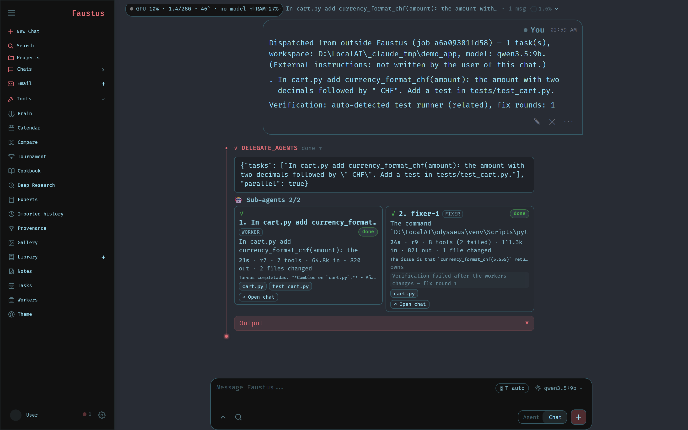
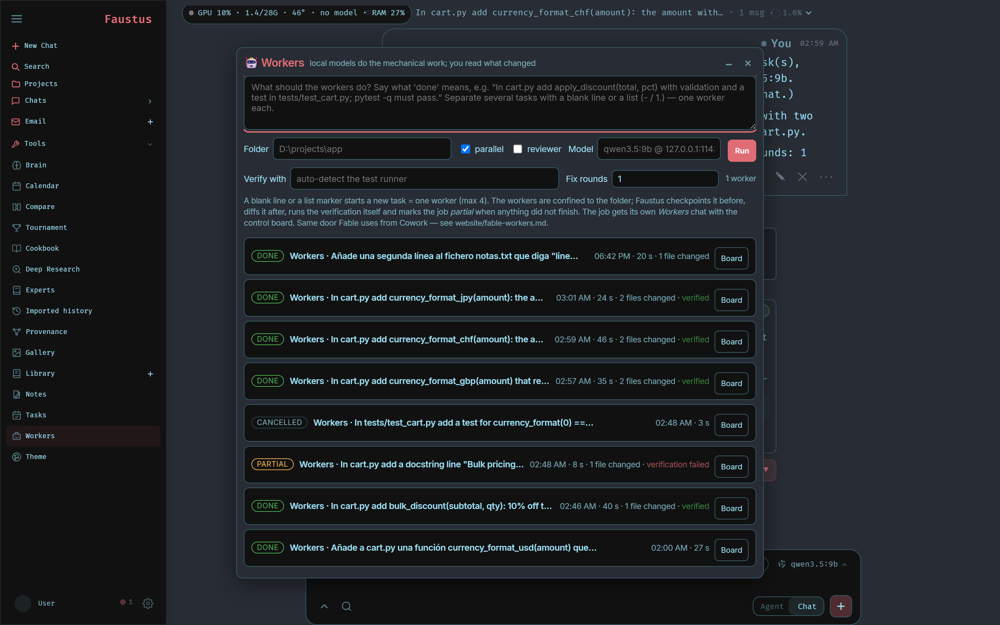

<p align="center">
  
</p>

<p align="center">
  A self-hosted AI workspace for local models, built around one idea:<br>
  <b>the agent has to prove what it did.</b>
</p>

<p align="center">
  <a href="#quick-start">Quick start</a> ·
  <a href="FAUSTUS.md">What this fork adds</a> ·
  <a href="website/setup.md">Setup guide</a> ·
  <a href="website/fable-workers.md">Workers API</a> ·
  <a href="ROADMAP.md">Roadmap</a>
</p>

<p align="center">
  
</p>

---

## What Faustus is

Faustus is a self-hosted workspace for running large language models on your own machine — chat,
agents, deep research, documents, email, notes, tasks, calendar, image gallery and local-model
management, all in one app talking to Ollama over `localhost`.

It is a personal fork of [Odysseus](https://github.com/odysseus-dev/odysseus), and it keeps
everything Odysseus does. What it adds is a different posture towards the model: **nothing the model
says about its own work is taken at face value.** Every claim is checked against evidence the app
collected itself, and when the evidence is missing, Faustus says so instead of agreeing.

Everything the fork adds — with dates, files, measurements and the bugs found along the way — is
recorded in **[`FAUSTUS.md`](FAUSTUS.md)** (in Spanish), which doubles as the fork's changelog.

## Why it exists

Faustus started from a concrete failure. Driving a local coding model through an agent loop, the
model would announce edits it had never made, invent file paths, and burn twenty minutes thinking at
two tokens per second. The interesting part is that none of those were "the model is dumb" problems.
They were plumbing problems, and each one had a root cause worth fixing:

- the tool selector didn't understand code requests written in Spanish, so the model never received
  `read_file` / `edit_file` and narrated instead of acting;
- temperature 1.0 on code tasks;
- Qwen3-Coder emits tool calls as plain text (`<function=…>`), which nothing parsed;
- `finish_reason=length` was ignored, so long answers were silently truncated;
- Ollama's `/v1` endpoint **silently drops** `think`, `top_k`, `repeat_penalty` and `num_ctx`
  (verified on 0.33.2), so half the model controls in the UI did nothing.

Fixing those made the model competent. Faustus is what was built on top so that it also has to be
**honest**.

## What the fork adds

### A reliability harness around every turn

Every turn keeps an evidence ledger: which tools ran, which failed, which paths were actually
written. When the model finishes, its prose is checked against that ledger. Claims of changes with
no writes behind them, references to files that don't exist, and "I'll now do X" followed by nothing
are **rejected with a `[Harness check]` message and sent back for another round** (max 2), after
which the answer is shown with a visible *not supported by evidence* note. Edits are syntax-checked
(`py_compile` / `node --check` / JSON) with a repair round, and a file silently substituted for the
one you asked about forces an honesty round.

The chat shows a 🛡 **Turn summary** card and a **Verified / Unverified** verdict, persisted with the
message.

### Functional verification, not just claim-checking

- **Project tests after every turn that changed something** — the runner is auto-detected (project
  command → pytest → npm test → cargo/go/make), run with a timeout and full process-tree kill, and
  with pytest only the tests *related* to the changed files are run. On failure, one repair round
  with the real output.
- **Automatic checkpoints and "restore to before this turn"** — a shadow repo, so your own `.git` is
  never touched, and it works in folders that aren't repositories at all.
- **Propose → apply mode**, per-file diff viewer with accept / reject / revert, and an auto-review of
  the diff by a second model.
- **Per-project agent controls**: trusted workspace, checkpoints on/off, project tests on/off, test
  command, reviewer model, plus an *Agent activity* audit tab.

### Workers: delegate the mechanical work, read only what changed

`delegate_agents` runs sub-agents in parallel, each in its own child chat with its own harness, file
locks, stall watchdog, deterministic supervisor (a clock and a counter — no LLM, zero tokens) and a
shared GPU semaphore. The board shows one card per worker: status, activity chip, elapsed, round,
tools, tokens in/out, the files it owns and the files it changed, plus **Stop / Steer / Open chat /
Re-run**.

`POST /api/dispatch` opens that loop to an outside coordinator — Claude in Cowork, Claude Code, any
MCP client — and returns a **compact, verified result** instead of a transcript:

- the workspace is **checkpointed before and diffed after**, so `files_changed` is what changed on
  disk, not what the worker said it changed (what it claimed but didn't do comes back as
  `claimed_only`);
- **Faustus runs the verification itself** — your command, or the detected test runner scoped to the
  changed files — and compares failures against the checkpoint, so a test that was already red
  doesn't get blamed on the worker;
- one bounded fixer round when verification fails;
- **honest status**: `done` only if every worker finished *and* verification passed or genuinely
  could not run. Anything else is `partial`, and the verdict says why in one line.

Measured on the reference machine: a task that burned **118k tokens inside the worker** came back to
the coordinator as **~1.5k tokens**. There's an [MCP server](mcp_servers/workers_server.py),
a ready-made [skill](integrations/faustus-workers/), and a **Workers** page in the app for the same
thing in plain language.

And the worker doesn't have to be Faustus. A dispatch can name an **external agent runner** —
OpenClaw, OpenCode, Hermes, Droid, Pi, Cline, Copilot CLI, Oh My Pi — and the job runs under it. The
catalogue is not hand-written: it is parsed from the `ollama launch --help` you actually have
installed, so a runner appears if you have it and disappears if you don't. Whatever a given runner
**does not let us check** enters the `prove` package as declared uncertainty rather than being taken
on trust.

<p align="center">
  
</p>

### Projects, objectives and a memory that learns

- **Projects** — a chat folder, a folder on disk, its own instructions and a file memory, with the
  agent controls above attached to each one.
- **Objective dashboard** — plan state lives in `<workspace>/.odysseus/objectives.jsonl`, not inside
  a chat's scrollback. The agent never rewrites the list: it emits typed `ADD` / `EDIT` / `KILL`
  deltas with a rationale, and a deterministic compiler orders, validates and **flags a conflict
  instead of overwriting a human edit**. Priority comes from the dependency graph.
- **Memory that learns and forgets by itself** — four decay levels, trust classes by origin,
  evidence spans back to the source chat, hybrid retrieval that degrades to lexical-only rather than
  erroring. Rules injected into a turn are marked, and when the turn ends with real verification they
  are scored helpful or harmful. A rule that keeps hurting is **inverted into an anti-pattern**. The
  curator is 100% deterministic — no LLM.
- **Destructive-command guard** with decision receipts.

### Experts with their own corpus

A narrative editor that has read your style guide; another that has read your course notes. The
corpus stays on your machine, there's no upload limit, and it re-indexes hot.

Corrections come back as **typed deltas anchored to a span** — never rewritten prose — and each span
is validated against its literal quote and relocated when the model's offsets are wrong. The point of
the whole feature is the honesty rule: a correction may only claim to come from the corpus if the
cited chunk actually supports it, checked in three cheap-to-expensive layers **without calling any
LLM**. When it doesn't, the correction is still shown, labelled *"model's opinion, not the corpus"*.
Page-level provenance never guesses a page number: unknown stays unknown.

### A provenance graph you can interrogate

2D, and built **only from edges that were already stored** — declared objective dependencies, memory
evidence spans, checkpoint file changes, corpus citations, literally-verified duplicates. Every edge
carries a one-sentence `why`. Not a single edge is asserted by a model. It answers two questions:
**`explain`** (why does the agent believe this?) and **`impact`** (what breaks if I touch this?).

### Deep research you can cite

Upstream's research wrote good prose that nobody could check. Now every page is numbered **the first
time it is seen** and never renumbered, so a citation written in round 2 still resolves in the final
report. URL identity is normalised — case, default port, trailing slash, fragment, a couple of dozen
tracking parameters — but **never `www.`**, because some hosts serve different content there and a
false merge attributes a claim to the wrong source.

The point isn't that the model writes `[n]`. It's that **python then audits it**, deterministically,
with no LLM and no network: a dangling `[7]` when there are five sources is deleted rather than left
in the text as a lie, the two citation grammars are fused into one, and the Sources section lists
only what is actually cited. It never fabricates a citation — an uncited paragraph stays uncited and
the coverage figure says so.

Claims are graded by the same five-layer verifier used elsewhere in the app, and the grade means
something narrower than it looks: **whether the cited source supports the sentence, not whether the
sentence is true in the world.** A live run made the difference matter — 51 of 57 citations came back
"weak" in a visibly well-sourced report, because the model writes Spanish, half the sources are in
English, and a translated paraphrase clears no lexical layer. So the scale was replaced by three
honest outcomes: *figures found in the source* / *figures absent from the source* / *not checked*.
On that run: 9 confirmed, **3 citing figures that are not in the source they point at**, 49
unchecked. Those 3 are the signal, and "weak: 51" had buried them.

The report also answers *your* questions in *your* language: sub-questions are pulled out of the
prompt deterministically and become the section headings **in your order** (if you asked four
numbered questions, the contents page has four), and the language is decided by stopword distribution
and passed explicitly to every prompt. The legend is printed by python from real counts, never by the
model — a model writing its own reliability legend is the thing this whole feature exists to prevent
— and it prints breadth **only when the report fell short of what it gathered**: a report resting on
two of the seven pages it read looks identical in prose to one that used all seven.

`GET /api/research/export/{id}?format=` hands it over as **md, docx, pdf, html, txt or json**. Not one
renderer was written for this: the report becomes blocks and goes through the conversation export
pipeline, with the chat chrome — a role banner, "1 message · Exported…" — suppressed for documents,
and byte-for-byte proof that an exported *conversation* is unchanged.

Search behind it: **SearXNG discovers, Firecrawl reads.** DuckDuckGo was never an API — it is scraped
HTML, and it dies on the second consecutive research. SearXNG is in this repo's `docker-compose.yml`,
pinned and with the JSON API on, so a default install has real search: same question, same model,
DuckDuckGo returned **10 URLs in 2 rounds**, SearXNG **36 in 3**. Self-hosted Firecrawl has no
fallback to the hosted API **on purpose** — quietly shipping a local-first user's searches to a third
party is not an acceptable degradation — and if the appliance is down, research falls back to the
native fetcher with a notice saying why.

### Local-model operations

- **Local models** panel — VRAM budget bar per card, what's resident right now with its GPU/CPU
  split, fit verdicts per quantisation, per-model `num_ctx` / `num_gpu` / `keep_alive` / `main_gpu`,
  live pull with progress that survives closing the tab, and an offline catalogue of 50 families
  annotated with what fits on *this* card.
- **Multi-GPU**, measured rather than assumed: which card each runner sits on and how many bytes,
  single / split / cpu placement per model, a *fill this GPU first* policy, orphan-runner detection
  and release. The numbers behind it are in [`FAUSTUS.md` §19–20](FAUSTUS.md) and
  [`website/gpu-placement.md`](website/gpu-placement.md).
- **Shared-memory spill detection** — the failure mode no other indicator shows: the model reports
  100% GPU while quietly paging over PCIe at 0.7 tok/s. Faustus warns, and the fit advisor proposes
  layers and KV quantisation that actually fit.

### Bring your past, and prove the present

- **History import** — ChatGPT, Claude, LM Studio and Faustus exports normalised into one model.
  A parser that doesn't recognise a file **says no instead of guessing**; a broken conversation is
  skipped with its reason while the other four hundred import fine; imports are idempotent; an
  unreadable date stays `None`, never "now". The LM Studio format is marked **INFERRED** in the
  module, because it is.
- **Two-tier search that works on a fresh install** — BM25 plus hash-projected embeddings that need
  no model and no network, fused with RRF, refined by the real embedder when there is one.
- **`prove`** — a canonical package with four verdicts, of which the one that matters is
  `unproved`: *the work may have happened and nothing can demonstrate it.* That is not a failure, and
  it is not `partial`.
- **Crash recovery** that never declares a job resumed without probing the process table, and a
  health score where a component with no data contributes **zero** — absence of signal is not absence
  of a problem.

### The perimeter, and the environment you inherit

- **An `AGENTS.md` inside a repository is somebody else's code.** Instruction files ship *with the
  repo you open*, so whoever sends a pull request sends instructions to your agent. Faustus treats
  them as untrusted content until you approve them — once, per file, per content hash. Change the
  file and it asks again. There is no "trust everything".
- **The service door.** The internal loopback token that lets the app's own tools call the app was
  privileged enough to reach `/api/storage/*`. It's blocklisted now, with a rejection message that
  explains why; `GET /status` stays open on purpose, because the agent needs it and it reveals
  nothing.
- **A child process should not inherit our virtualenv.** Faustus runs inside its own venv, so every
  subprocess inheriting that environment resolves `python`, `pip` and its imports against *ours* —
  the user's project tests, an external runner, a pre-commit hook. The symptom is the worst kind:
  works on the machine of whoever wrote it, imports the wrong package on everyone else's. The venv
  markers and the `PATH` entries inside it are stripped before spawning a child that isn't ours,
  while our own children keep inheriting it deliberately.
- **No automatic commit into a repository mid-operation.** A checkpoint commit landing during a
  rebase, merge or cherry-pick is destructive and silent. Preconditions are checked — not a work
  tree, an operation in progress, detached `HEAD`, an unexpected remote or branch — and *all* the
  failures are reported, not just the first. The commit is refused, and there is no flag to skip it.

## Everything Odysseus already did — still here

Chat with local and API models, tools, MCP, files, shell, skills and memory · **Cookbook**
(hardware-aware model recommendations, downloads, serving) · **Deep Research** *(rebuilt above)* ·
**Compare** (blind
side-by-side) · **Documents** (writing-first editor with AI edits and suggestions) · **Email**
(IMAP/SMTP with triage, tags, summaries, reminders, reply drafts) · **Notes, Tasks and Calendar**
with CalDAV sync · gallery and image editor, themes, uploads, web search, presets, sessions, 2FA.

Faustus adds to that list: **Workers**, **Experts**, **Tournament** (multi-model, blind round 0, with
explicit merge), **Provenance**, **Imported history**, and **Brain → Rules**.

## Quick start

```bash
git clone https://github.com/Luissalet/Faustus.git
cd Faustus
cp .env.example .env
docker compose up -d --build
```

Open `http://localhost:7000` when the containers are healthy. The first admin password is printed in
`docker compose logs odysseus`. A pinned SearXNG comes up with it, so web search and deep research
work on a fresh install without an API key.

Native installs, GPU notes, Windows/macOS instructions, HTTPS and configuration live in the
[setup guide](website/setup.md).

> **Internal identifiers still say `odysseus` on purpose.** Environment variables (`ODYSSEUS_*`),
> `localStorage` keys, CSS ids, module names and the container name are unchanged, so upstream
> changes keep merging cleanly and existing data directories keep working. Only the visible name,
> the branding and the docs are Faustus.

## Driving Faustus from Claude, Cowork or Claude Code

The **workers MCP server** lets an outside coordinator plan and review while local models do the
mechanical work:

```
workers_guide · dispatch_workers · workers_wait · workers_status · workers_events · workers_cancel
```

It needs a token with the `agents:dispatch` scope. Setup, the shape of the compact result and how to
read it are documented in [`website/fable-workers.md`](website/fable-workers.md); the skill lives in
[`integrations/faustus-workers/`](integrations/faustus-workers/).

## How this fork is built

Every block of work follows the same loop, and it is the reason the list above is as long as it is:
build behind a feature-owning sub-agent in a worktree, **verify in the browser against a real local
model** on a live instance, then audit the new modules with an adversarial sub-agent that must write
a failing reproduction test for each finding before anything is fixed. Several of the most useful
bugs — TOON projections that came out *larger* than JSON, two SSE endpoints in the same app speaking
different dialects, `LOCALHOST_BYPASS` making the app unusable in a browser, a research report whose
75 citation markers all resolved while the whole thing rested on two of the seven pages it had read —
were invisible to the test suite and only appeared from actually using the thing.

Where a mechanism was borrowed from someone else's project, the reasoning and the measurement are
written down, including when the borrowed formula turned out to be worse than the simple version.

## Numbers

As of 2026-09-03, against the fork point (`c9dd68d8`):

| Measure | Value |
|:--|:--|
| Commits on top of upstream | 351 |
| Lines changed | +137,900 / −1,600 across 638 files |
| New modules in `src/`, `routes/`, `services/`, `static/js/` | 113 |
| New test files | 185 |
| Tests collected | ~9,100 (`pytest --collect-only -q tests`) |
| End-to-end flows (Playwright) | 12 |

Reference machine: RTX 4070 Ti 12 GB + RTX 5060 Ti 16 GB (eGPU), 128 GB RAM, Windows 11,
Ollama 0.33.x, running `qwen3-coder:30b`, `qwen3.5:9b`, `qwen3.8:27b` and `qwen3-coder-next`. Known
platform-specific test failures — and the bisection proving they are not regressions — are documented
in [`FAUSTUS.md` §24.4](FAUSTUS.md).

## Relationship to Odysseus

Faustus is a fork, not a replacement, and it owes the whole workspace to
[odysseus-dev/odysseus](https://github.com/odysseus-dev/odysseus). Upstream changes are merged in
regularly (`git fetch upstream && git merge upstream/dev`). Credits for the projects Odysseus itself
builds on are in [ACKNOWLEDGMENTS.md](ACKNOWLEDGMENTS.md).

## Security

Faustus is a self-hosted workspace with powerful local tools: a shell, file access, a browser, and
desktop control. Keep authentication on, keep private data out of Git, and do not expose raw
model/service ports publicly.

- Keep `AUTH_ENABLED=true` for any network-accessible deployment.
- Keep `LOCALHOST_BYPASS=false` outside local development.
- Desktop input tools ask for approval **on every call**, above any per-task or per-chat approval.
- Model-reachable API surfaces are deny-listed for mutations: the model can read what fills the disk,
  and cannot act on it.
- Instruction files (`AGENTS.md`, `CLAUDE.md`) found inside a workspace are untrusted until you
  approve them, per file and per content hash — see
  [the perimeter](#the-perimeter-and-the-environment-you-inherit).

The threat model is in [THREAT_MODEL.md](THREAT_MODEL.md); reporting instructions in
[SECURITY.md](SECURITY.md). Deployment details are in the
[setup guide](website/setup.md#security-notes).

## Contributing

This is a personal fork, so upstream-flavoured contributions are best sent to
[Odysseus](https://github.com/odysseus-dev/odysseus) itself. If something here is broken or wrong,
issues are welcome. See [CONTRIBUTING.md](CONTRIBUTING.md) and [ROADMAP.md](ROADMAP.md).

## License

AGPL-3.0-or-later — see [LICENSE](LICENSE) and [ACKNOWLEDGMENTS.md](ACKNOWLEDGMENTS.md).
