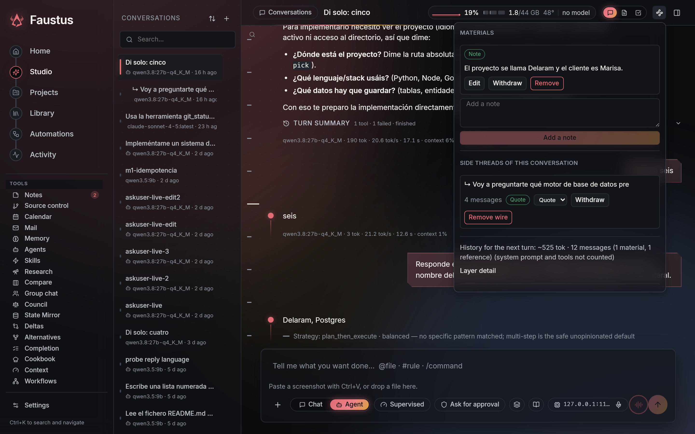
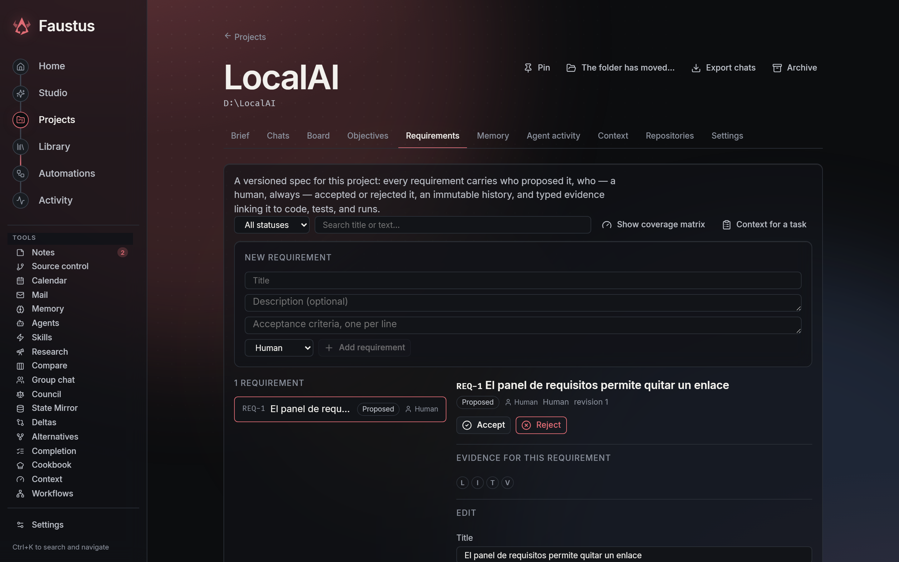
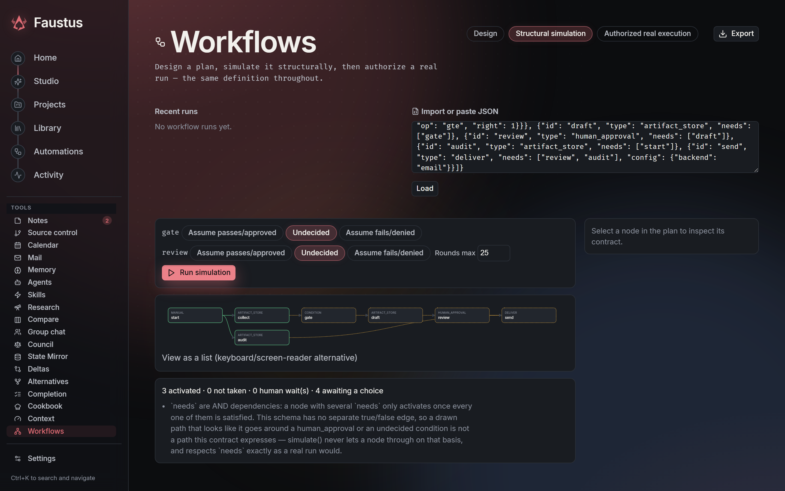

<p align="center">
  
</p>

<p align="center">A self-hosted AI workstation for local models, cloud providers and agent teams.</p>

<p align="center">
  <a href="README.es.md">Español</a> ·
  <a href="#quick-start">Quick start</a> ·
  <a href="#what-you-can-do">Capabilities</a> ·
  <a href="#architecture">Architecture</a> ·
  <a href="website/setup.md">Setup guide</a>
</p>


## What Faustus is

Faustus brings chat, coding agents, research, writing, image and video workflows, voice, and project knowledge into one workspace. It is a personal [Odysseus](https://github.com/odysseus-dev/odysseus) fork, with a Python/FastAPI backend and a React/TypeScript interface.

Use local models through Ollama and compatible servers, or connect cloud APIs. Configure an orchestrator and its specialist agents inside a conversation. Keep work, sources, generated files and project context together, and see what is running rather than guessing whether a model has frozen.

The recurring idea is that the agent has to show its work: which context a turn was built from, which tool produced which evidence, which model answered and what it cost, which approval unlocked which action. Every feature below has a test that fails when that stops being true, and a section in [FAUSTUS.md](FAUSTUS.md) that explains why it exists.

Local-first means you choose where inference happens. Cloud APIs and authenticated official clients use their provider's billing or subscription quota; local inference uses your own hardware. Selecting a remote provider sends it the context needed for that request.

## Quick start

Install Docker and Docker Compose, then:

```bash
git clone https://github.com/Luissalet/Faustus.git
cd Faustus
cp .env.example .env
docker compose up -d --build
```

On PowerShell, use `Copy-Item .env.example .env` instead of `cp`.

Open **http://localhost:7000**. The initial administrator password is printed in `docker compose logs odysseus`. Compose includes the search and vector-store services; it does not download a language model for you.

1. Connect your model server in Settings or Cookbook. For Ollama running on the Docker host, configure its reachable address using the [setup guide](website/setup.md).
2. Create a project and attach the files, documents or sources it should know.
3. Start a conversation. Choose **Chat** for conversation or **Agent** for tools and actions.
4. Use **Activity** to follow running conversations, workflows, renders and approvals.
5. Add image/video engines, voice services or external agent clients when you need them.

Native installation, Windows/macOS instructions, GPU setup, HTTPS and environment configuration: [setup guide](website/setup.md). Preserve your `data/` directory and back it up before upgrades.

## What you can do

### Windows desktop and web launchers

Launchers live in this repository and resolve paths relative to the checkout:

| Launcher | Action |
| --- | --- |
| `Start-Faustus-Desktop.bat` | Open a native Electron window with theme-aware minimize, maximize/restore, full-screen and close controls. |
| `Start-Faustus.bat` | Start Faustus and open the web interface in your browser. |
| `Stop-Faustus.bat` | Stop the server managed by these launchers. |
| `Restart-Faustus.bat` | Restart that server and open the web interface. |

Python and Node.js are required for first-time setup. The launchers prepare missing dependencies, rebuild stale Studio assets and install the pinned desktop runtime when needed. `Start-Faustus.ps1 -NoBrowser` starts web mode without opening a tab; `-Port 7001` selects another port.

Closing the desktop window stops the backend **only if that window started it**. An already-running web server is reused and remains running when the window closes. Process ownership is verified; unrelated Python processes and external model servers are not stopped. Desktop authentication is separate from your browser, so sign in once in the window.

Scheduled work requires a running Faustus server and an awake computer. Use web mode to leave the backend running after closing browser tabs; closing an owning desktop window stops scheduling too. In Agent chat, request a recurrence in English or Spanish, specify a time and time zone, and manage the saved task under **Automations**. Recurring tasks support IANA time zones and daylight-saving changes; existing tasks without a zone retain their UTC behavior.

### Creative tools inside the conversation

- **Point-to-edit:** select a point in a captured browser frame and describe the change. An annotated screenshot and capture provenance are added to the draft, not sent automatically. The agent must inspect the current page and project; screenshot coordinates are not invented source-code mappings.
- **Project visual references:** save named `@references` as project context links, distinguish subject, style and composition, and explicitly attach them from the picker. Removing a reference link does not delete its gallery image.
- **Learn a style:** derive editable style rules from TXT/Markdown examples using the selected model, compare baseline and styled answers, then save and select a preset. Comparison makes two model calls using the selected connection.
- **Local video:** transcribe with an already-installed Whisper model, edit or manually translate timed segments, export SRT/VTT, and render narration using installed Windows English or Spanish voices. No cloud API or automatic model downloads. Inputs are bounded to 64 MB, 3 minutes and 1080p; FFmpeg/FFprobe are required. This is practical local narration, not voice cloning or lip-sync. Original audio is replaced in the narrated export.

### Chat and a persistent workbench

- Switch between local and API models; connect OpenAI, Claude, Gemini and OpenRouter through guided API setup with connection testing. OpenRouter calls report their real cost, per-endpoint preferences (data collection, provider order, web search only when asked) are explicit, and a local-only privacy profile refuses outbound calls instead of downgrading silently.
- Paste screenshots directly with **Ctrl+V**, upload attachments and reference workspace files.
- Navigate long chats with the message rail: hover previews, click/drag to jump, or use arrows, Home/End and Page Up/Down. Browsing older messages pauses automatic stream following.
- Read generated Markdown beside the chat, edit it and save it with conflict detection. Unsaved drafts belong to their conversation and survive panel navigation. Three Studio layouts (conversation, document, review) share one document session, so a selection in the document becomes a context chip in the composer and a suggestion from the agent lands with its anchor, never on the first matching line.
- Keep files, generated outputs, sources, project context, agent activity and browser captures in a resizable side panel.
- Move to another conversation while the server keeps the current turn running. See queue position, current activity, tool use and permission requests; reconnect to the existing work. An approval card whose permission died with a restart says so instead of offering dead buttons.
- Every turn shows the strategy the agent chose (direct edit, plan then execute, research, specialised review, explore alternatives) and why; a turn worth repeating can be saved as a recipe with its real inputs.
- Search and navigate with **Ctrl+K**. Use English or Spanish, themes, density controls, adjustable text and reduced motion.

### Side threads and context wires

What the model sees next is exactly what is wired to the conversation — a rule borrowed from [ThoughtDAG](https://github.com/chenxiachan/thoughtdag) and applied to ordinary linear chats. The human draws the graph; no agent creates wires on its own.

- **Explore separately:** select a passage in a reply and open a side thread that sees the conversation up to that turn plus the passage, then grows on its own. The original conversation does not change. The thread list indents side threads under their parent, and a thought map shows the tree.
- **Bring it back:** wire the side thread into its parent as an explicit reference block — latest exchange, or the whole thread — change its depth, withdraw it or remove it. A withdrawn wire keeps the thread.
- **Materials:** pin a document selection (or the live document) and free-form notes as context that stays until you withdraw it. The *Context wires* panel previews the next turn layer by layer with token counts, and says what it does not count.
- **Replay under a button:** every reply records which wires it was written against. When a side thread or document moves on, the affected replies say so and offer *Regenerate with the current version*; nothing regenerates by itself.
- **Condense by hand:** pick a range of settled turns and fold them into one summary row using the same summarizer as automatic compaction, on your own model. *Expand* restores the originals byte for byte; the turn in progress is never eligible.



### Coding, tools and agent teams

- Define an **orchestrator and its minions from the chat**, choosing models, roles and tool restrictions.
- Delegate to child conversations with file ownership, progress, cancellation and steering.
- Use **Council** for blind first rounds, critique and synthesis across multiple models, with a designated executor for actions.
- Use skills, MCP tools, filesystem tools, shell execution and browser capabilities under the configured permissions.
- Connect official **Codex CLI and Claude Code workers** through the existing runner/dispatch system. Both also have private text-model connections for the Faustus chat loop, with an explicit subscription/API choice. Codex chat uses an ephemeral, environment-less App Server thread; Faustus retains tool execution and approvals.
- Keep subscription and API routes explicit. Official-client authentication is checked before work; a subscription error does not silently fall back to paid API usage.
- Inspect tool evidence, syntax checks, project tests and review results. Shadow-git checkpoints support diffs and restoration without replacing the project's own repository.
- Reopen original change evidence from a turn's summary. Owner-scoped receipts survive restarts, distinguish saved evidence from verified success, and feed the project's State Mirror; incognito turns are excluded. [Evidence history](docs/design/durable-change-evidence.md).
- **Source control** without leaving the workspace: repositories discovered from linked folders, identities from `~/.ssh/config`, manual entries and `gh` accounts, create/clone/publish on GitHub, branches, merges and pushes from a panel with a draggable edge, and a per-repository policy the agent's `git_*` tools obey (the shell refuses `git commit`/`push` on their behalf). [Git API](docs/api/git.md).
- **Ask for tools in plain English or Spanish.** Every built-in tool carries example phrasings and domain synonyms, tools you name or hint at are always offered, and a vague message with a workspace never gets `bash` or `write` on the strength of an embedding.
- **Alternatives:** try several approaches to the same change in isolated worktrees or frozen copies, compare them against the base with contested files called out, and apply one with a three-way merge — a hand edit you made meanwhile survives. Document alternatives work the same way on document versions. [Alternatives API](docs/api/alternatives.md).
- **Semantic desktop control** through the accessibility tree first and pixels only as an explicit, riskier fallback; taking the desktop back invalidates the agent's stale references. [Desktop semantics](docs/api/desktop_semantics.md).

These checks provide evidence about supported actions; they are not a proof that every model statement is true. Tool access, automatic verification and external runners are configurable rather than implicitly enabled by choosing a model.

### Project knowledge and extended context

Project identity is stored independently of the sidebar folder name. An agent can attach a generated document or another supported source to its current project's context by reference.

The context engine retrieves and budgets relevant material from project sources, history and memory. It tracks provenance, conflicts and compact context capsules instead of trying to place an entire disk in a model's prompt. Persistent storage extends what can be retrieved, **not the model's native context window**.

Use **Skip memory recall** in the composer to suppress automatic personal-memory retrieval for subsequent messages, including live context compilation. Existing chat history and project sources remain available. This does not disable memory tools or saving the chat; use Incognito for its separate privacy behavior.

In Agent mode, **Agent context** also lets you skip automatic skills and select a soft input-token budget before sending. These controls travel with the turn without changing global settings. The budget is an estimate, remains bounded by the selected model's context window, and is not a billing cap. Explicit tools and project instructions remain available when automatic skills are skipped.

A project also carries:

- a **board** of typed issues (`KEY-N` ids, priorities, labels, links, comments) with a kanban and a table view, Markdown import/export, and commit messages that close issues with *fixes*/*closes*/*cierra*/*arregla*; the agent gets `board_*` tools and a summary of open work in its prompt ([Board API](docs/api/board.md));
- a **versioned requirements spec**: every requirement records who proposed it, who — a human, always — accepted or rejected it, an immutable revision history, and typed evidence linking it to code, tests and runs, with a coverage matrix and a budgeted "context for this task" the agent can ask for ([Requirements API](docs/api/requirements.md));
- a **knowledge neighbourhood** that joins requirements, decisions, symbols, tests and runs into one typed graph with `declared`/`located`/`verified` relations and an honest `stale` flag, plus per-turn context receipts that say which files actually fed an answer ([Knowledge API](docs/api/knowledge.md)).

**Attention** answers "what needs me now?" across every conversation, run and workflow along four axes — lifecycle, cause of waiting, connection health and next action — so a pending approval, a GPU queue and a dropped connection are one list, not three tabs. [Attention API](docs/api/attention.md).



### Connected systems

| System | Purpose | Implementation |
| --- | --- | --- |
| Project Context Links | Bind chats and reusable sources to stable projects; add and resolve context by reference. | [project_context](src/project_context/) |
| Context Engine | Retrieve, rank, budget and explain the context assembled for a turn. | [context_engine](src/context_engine/) |
| Side threads & context wires | Branch a conversation from a passage, wire references, documents and notes explicitly, replay stale answers on request, condense by hand. | [side_threads.py](src/side_threads.py), [condense.py](src/condense.py) |
| Model Router | Choose a local or remote model per turn from calibration, measured speed and history; never escalates to a paid route without an explicit allowance; explains the fit of every candidate. | [model_router.py](src/model_router.py), [Router API](docs/api/model_router.md) |
| Provider policy & admission | Local-only and subscription-vs-API decisions made once and enforced on every outbound call; pooled admission for GPU, CPU-heavy and foreground work. | [provider_policy.py](src/provider_policy.py), [resource_admission.py](src/resource_admission.py) |
| Agent Profiles & Completion Modes | Reusable specialist profiles and task-dependent completion policies, within existing permissions; a lint that catches cycles and unreachable roles. | [agent_profiles](src/agent_profiles/), [agent_profile_lint.py](src/agent_profile_lint.py) |
| Strategy & recipes | An observable per-turn strategy that escalates only on observed failure, and reusable recipes built from real runs. | [strategy_policy.py](src/strategy_policy.py), [recipes.py](src/recipes.py) |
| Requirements | A versioned, human-accepted spec with typed evidence and coverage. | [requirements](src/requirements/) |
| Project Board | Typed issues, kanban, commit-closing links and agent tools. | [project_board.py](src/project_board.py) |
| Git panel | Repositories, identities, GitHub, branches and a per-repository policy the agent obeys. | [git_panel.py](src/git_panel.py) |
| Teach Mode | Capture demonstrations as reusable procedures, with review and execution controls. | [teach mode routes](routes/teach_mode_routes.py) |
| Immune System | Record incidents, evidence and corrective rules for recurring failures. | [immune_system](src/immune_system/) |
| Branching Futures & Alternatives | Explore alternative approaches in isolated branches, worktrees or document versions before choosing one. | [branching_futures](src/branching_futures/), [alternatives.py](src/alternatives.py) |
| Council | Organize multi-model discussion, critique, decisions and controlled execution. | [council](src/council/) |
| Workflows | Durable graphs with structural simulation, preflight, cost estimates with separate counts for activations, model calls and external operations, plan comparison and a canvas. | [workflows](src/workflows/), [workflow_cost_estimate.py](src/workflow_cost_estimate.py) |
| Attention | One list of what needs a person, across everything that is running. | [attention.py](src/attention.py) |
| Desktop semantics | Accessibility-tree desktop control with explicit channel choice and evidence. | [desktop_semantics](src/desktop_semantics/) |
| State Mirror | Keep timestamped observations with freshness and provenance; verify and restore materialized state from its committed journal. | [Recovery](docs/design/state-mirror-recovery.md) |
| Universal Delta Engine | Compare intended and observed changes across supported domains. | [delta_engine](src/delta_engine/) |
| Greedy Completion Engine | Discover and assess useful follow-up work according to the chosen mode, scope and budget. | [completion_engine](src/completion_engine/) |
| Jarvis voice | Voice interaction in English and Spanish, spoken replies and a reactive sphere. | [voice guide](docs/design/voice-jarvis.md) |

For implementation details, see [FAUSTUS.md](FAUSTUS.md). Current verification work is tracked in [PENDIENTES.md](PENDIENTES.md).

### Images, video and audio

- Mark attached images as subject/character, style or composition references. The selected roles become visible guidance in the sent message; they do not guarantee pixel-level conditioning. Gallery images can start a new reference chat while retaining the link to their original conversation.
- Open an attached image's thumbnail in the full editor, including masks and inpainting, without losing the chat draft. **Attach result to chat** saves the layer/mask draft and returns a PNG copy without sending a message. Inpainting requires a configured compatible image service.
- Plan and run approved **ComfyUI recipes** for images, reference editing and short video. Inspect required models before queueing work.
- The chat's **Media recipe** picker exposes installed recipes and their inputs, checks engine requirements without queueing a job, and adds an editable request to the draft. Reference-edit recipes support variations with strength and seed controls; engine-side image names are distinguished from chat attachments.
- With multiple configured engines, select by availability, queue and capacity, retaining the reason for the choice.
- Preserve recipe, version, seed, model licence, engine job and input digest with generated artifacts.
- Collect submitted renders in the server even with no chat open. Interrupted downloads remain retryable; completed outputs appear in Activity.
- Inspect image, audio and video properties before deciding how to process them.
- Convert and resize PNG/JPEG/WebP images and extract WAV/MP3 audio with scoped media tools, progress and cancellation.
- Download outputs through owner-scoped artifact links. Identical bytes can be shared physically without merging ownership or provenance.
- Expand **File provenance** beside Activity downloads to inspect size, type, SHA-256, partial/complete status and originating run, project or conversation.

ComfyUI is a separate service; model weights, custom nodes and their licences are not bundled. Use [media recipes](config/media_workflows/) and [workers documentation](website/fable-workers.md) to configure the engines.

### Research, documents and everyday work

- Research with source tracking, citation checks and report export.
- Retain labelled original-source excerpts when extraction fails, preserve the previous report if final generation is empty, and pass bounded evidence alongside summaries. Shared scheduled lookups recover from cancellation without stranding other tasks. [Diogenes adaptations](docs/design/diogenes-adaptations.md).
- Write and edit documents; export supported content to Markdown, text, HTML, PDF, DOCX or JSON.
- Search imported ChatGPT, Claude, LM Studio and Faustus history alongside local knowledge.
- Organize notes, tasks and calendars; connect email with IMAP/SMTP and calendars through CalDAV.
- Compare models, run expert reviews and inspect provenance and learned rules.
- Monitor local model memory, GPU placement, fit estimates, downloads and service health through Cookbook.
- Launch local servers with a verified configuration: model architecture (dense/MoE, multi-token prediction) is read from metadata rather than the model name, each launch option is checked against a per-implementation capability manifest before the command is built, and a launch receipt shows what was requested, what was applied and what the server confirmed. Every reply carries measured phases (queue, load, prefill, generation, tools) with their source under "Why did it take this long?" — a phase the engine does not report is shown as absent, never as zero.
- Benchmark a running configuration on your own machine from Cookbook → *Optimize for my machine*: explicit plan and budget before anything runs, one model at a time, deterministic quality checks (no LLM judge), and a comparator that only marks a profile as recommended when speed improves beyond the observed noise without losing quality.

### Durable workflows

Compose triggers, conditions, waits, human approvals, media steps and stored reports. Server-side continuation advances started workflows and wakes timed steps. Attempts have leases and conditional writes so late results do not overwrite a cancellation or a newer attempt.

Generated reports can resolve text from the run's inputs or previous results and save it as an owned artifact. Workflow outputs inherit the verified project and conversation scope. Activity shows dependencies, reasons for waiting and links to output files.

Project workflows can run declared Python, JavaScript and Bash skill scripts in Docker, with a bounded source snapshot, permissions bound to the exact code and command, and collected output files. [Script skill setup](docs/design/workflow-script-skills.md) describes the contract and prerequisites. Process output is drained continuously and retained as bounded tails so verbose scripts cannot exhaust host memory.

Cancelling a running script workflow also stops its container. The worker checks the exact live attempt and lease, and cancellation during container setup prevents the script from starting. Partial external effects remain explicit and are not automatically retried.

Script credentials are encrypted per owner and bound explicitly by name and revision to approvals. Rotation invalidates pending execution; workflows never inherit unrelated provider keys. Human-only credential endpoints and configuration are described in the script skill guide.

Project objectives accept typed updates from agents without losing simultaneous changes. Human edits are protected against stale agent updates, including edits within the same second; damaged state files are preserved during recovery.

The [email delivery step](docs/design/workflow-email-delivery.md) sends text with optional HTML, CC/BCC and bounded workflow-content attachments through an owned SMTP account. Approval binds every recipient and the exact content, including attachment hashes. Approvals are consumed once at execution, approved waits resume automatically, and an uncertain external effect is not retried automatically. SMTP acceptance is recorded separately from inbox delivery.

Workflow nodes that perform external actions still need the appropriate configured capability and authorization. Cancelling stops subsequent work; it cannot undo an external action that already occurred.

The **Workflows** screen draws a definition as a layered graph with three explicit modes — design, structural simulation, authorized real execution — the same definition throughout. Simulation walks the graph round by round without side effects, leaves undecided conditions undecided rather than guessed, and never bypasses an AND dependency because a second path happened to be clean. Definitions import from this module's canonical export or an aigraphstudio-shaped graph, export back, and deep-link to a run.



### Adaptation history and demos

Three offline-checkable walkthroughs — a document with real review, a supervised agent end to end, semantic desktop control — are described in [docs/showcase.md](docs/showcase.md), each citing the files that implement it and the test that covers it, plus a small sample project under `examples/showcase/`. The adaptation backlog behind these features, audited row by row against the real code rather than asserted, lives in [docs/adaptations/](docs/adaptations/) (baseline classification and per-feature decision records).

## Voice

Jarvis provides a voice session with English/Spanish recognition, spoken replies, interruption controls and a reactive visual sphere. Configure the available transcription and speech services in the app; browser microphone permission is required. Installed voices and local speech engines determine available languages and playback.

Voice input enters the same conversation and tool-permission flow as typed input. A voice session is not blanket authorization for filesystem, desktop or external actions.

## Architecture

| Area | Code |
| --- | --- |
| HTTP application and persistence | [app.py](app.py), [routes](routes/), [core](core/) |
| Studio interface and state | [studio/src](studio/src/) |
| Model transport and official-client bridge | [llm_core.py](src/llm_core.py), [cli_model.py](src/cli_model.py), [runner_billing.py](src/runner_billing.py) |
| Worker dispatch and process supervision | [dispatch.py](src/dispatch.py), [external_worker.py](src/external_worker.py) |
| Durable workflows | [workflows](src/workflows/) |
| Media engines and continuation | [media_runs.py](src/media_runs.py), [media_scheduler.py](src/media_scheduler.py), [media_backends](src/media_backends/) |
| Artifacts, identity and migration | [artifact_store.py](src/artifact_store.py), [artifact_identity.py](src/artifact_identity.py), [artifact_migration.py](src/artifact_migration.py) |
| Regression and interface checks | [tests](tests/), [studio/checks](studio/checks/) |

The artifact store separates content-addressed bytes from owned output occurrences. Additive migration preserves historical identifiers and metadata; removal markers prevent deleted occurrences from being recreated by migration.

Internal names such as `odysseus`, `ODYSSEUS_*`, existing API paths and storage keys are retained for compatibility. The product name is Faustus.

## Development and verification

Use the project's configured Python environment and install the development dependencies described in [tests/README.md](tests/README.md).

```bash
python -m pytest
npm ci
npx tsc --noEmit
npm run build
python -m src.doctor
```

The suite includes owner isolation, persistence, concurrency, cancellation, migration, HTTP integration and headless interface checks. Hardware engines and account integrations also need tests in their configured environment; an HTTP fixture does not demonstrate model quality or a provider's account access.

Measured on 12 September 2026: 16,993 tests pass on Linux (`-m "not slow"`, about ten minutes on two workers) and the same tree passes on Windows with Docker Desktop running the container-backed cases; 295 modules under `src/`, 116 route modules, 149 Studio screens, 21 API documents under `docs/api/`, and 76 dated sections in `FAUSTUS.md` recording what each change was for and how it was verified. Interface checks run the real TypeScript through esbuild under Node rather than re-implementing it in Python.

Current verification results and remaining checks are listed in [PENDIENTES.md](PENDIENTES.md).

## Screens

<details>
<summary>Activity, agents and automations</summary>

Follow tasks and approvals in Activity.


Configure workers, runners and their verification settings.


Inspect and control recurring work.


</details>

## Security and data

Context packet summaries include a memory-selection receipt: included entries, omissions and reasons, character usage and degradation. It describes the final Context Engine packet without querying memory again or adding a second selection pass.

Keep `AUTH_ENABLED=true` for any network-accessible deployment.
Keep `LOCALHOST_BYPASS=false` outside local development.

Keep authentication enabled. Do not expose unauthenticated model, ComfyUI or internal service ports publicly. Keep credentials and private `data/` files out of Git.

Bitwarden sessions are encrypted at rest and expire after one hour, shared by settings and agent tools. Old plaintext sessions are discarded on access and require unlocking again. Protect `data/.app_key`: encryption does not protect against a compromised host.

Approve tools and project instructions deliberately. Per-agent restrictions, owned sources, approval gates, sandbox settings and process supervision are separate controls. When a required sandbox is unavailable, the configured sandbox path must not silently run the command on the host.

See the [threat model](THREAT_MODEL.md), [security policy](SECURITY.md) and [setup security notes](website/setup.md#security-notes).

## Credits and licence

Faustus builds on [Odysseus](https://github.com/odysseus-dev/odysseus). See [ACKNOWLEDGMENTS.md](ACKNOWLEDGMENTS.md) for additional credits, [CONTRIBUTING.md](CONTRIBUTING.md) for contribution guidance and [LICENSE](LICENSE) for **AGPL-3.0-or-later**.
