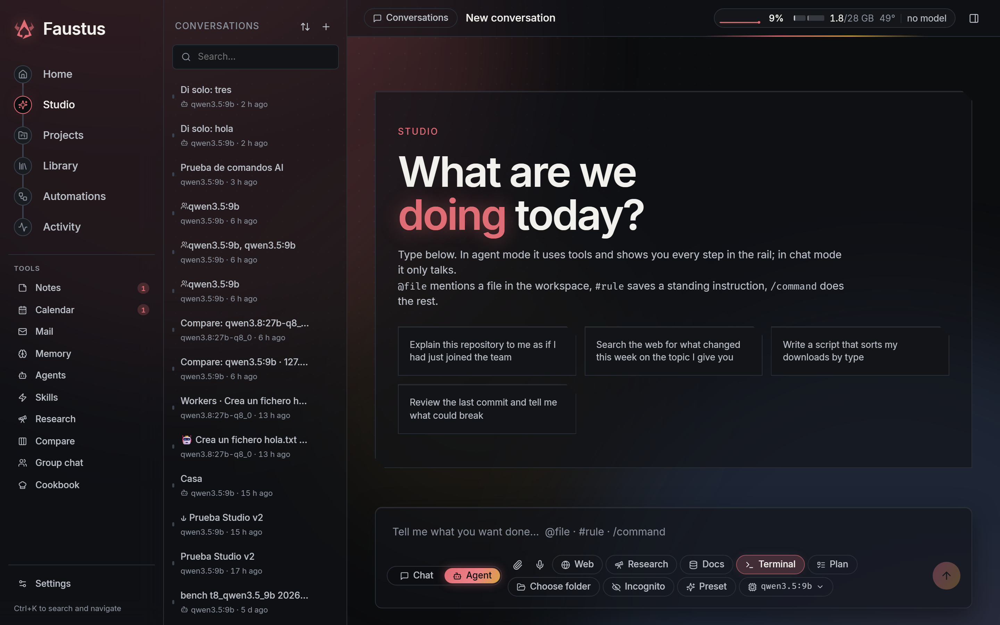
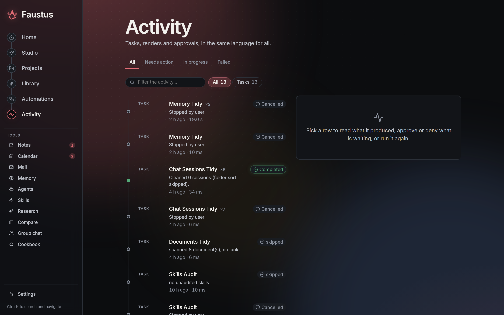
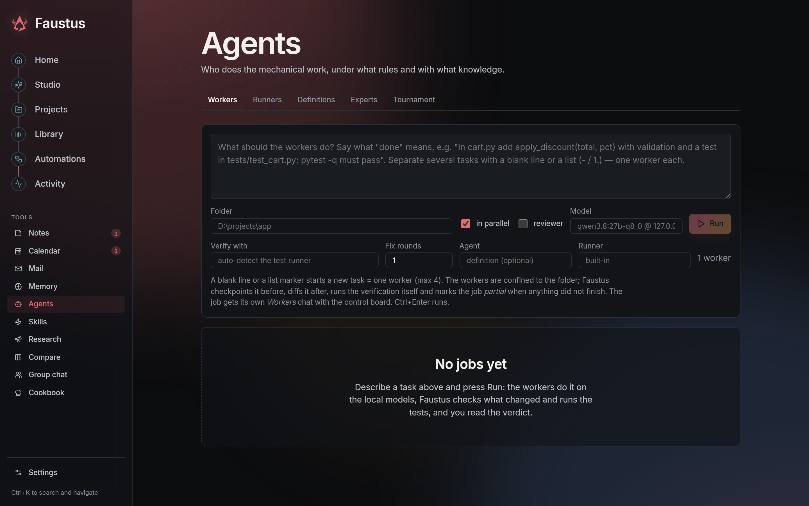
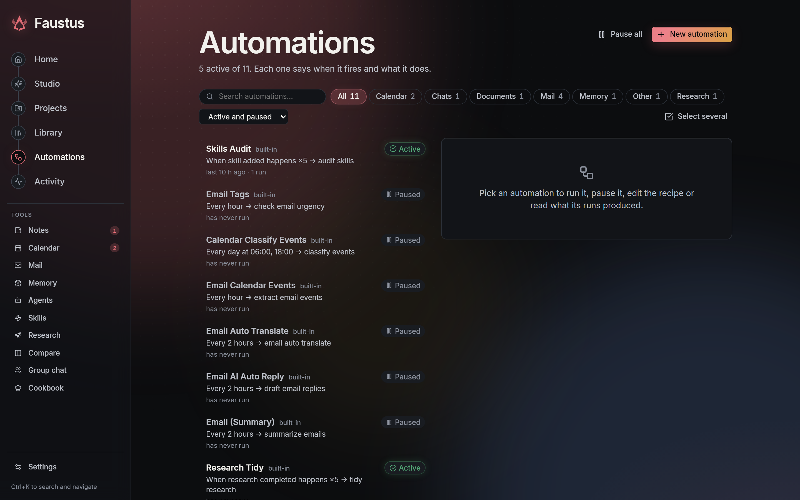

<p align="center">
  
</p>

<p align="center">A self-hosted AI workstation for local models, cloud providers and agent teams.</p>

<p align="center">
  <a href="README.es.md">Español</a> ·
  <a href="#quick-start">Quick start</a> ·
  <a href="#what-you-can-do">Capabilities</a> ·
  <a href="#architecture">Architecture</a> ·
  <a href="website/setup.md">Setup guide</a>
</p>



## What Faustus is

Faustus brings chat, coding agents, research, writing, image and video workflows, voice, and project knowledge into one workspace. It is a personal [Odysseus](https://github.com/odysseus-dev/odysseus) fork, with a Python/FastAPI backend and a React/TypeScript interface.

Use local models through Ollama and compatible servers, or connect cloud APIs. Configure an orchestrator and its specialist agents inside a conversation. Keep work, sources, generated files and project context together, and see what is running rather than guessing whether a model has frozen.

Local-first means you choose where inference happens. Cloud APIs and authenticated official clients use their provider's billing or subscription quota; local inference uses your own hardware. Selecting a remote provider sends it the context needed for that request.

## Quick start

Install Docker and Docker Compose, then:

```bash
git clone https://github.com/Luissalet/Faustus.git
cd Faustus
cp .env.example .env
docker compose up -d --build
```

On PowerShell, use `Copy-Item .env.example .env` instead of `cp`.

Open **http://localhost:7000**. The initial administrator password is printed in `docker compose logs odysseus`. Compose includes the search and vector-store services; it does not download a language model for you.

1. Connect your model server in Settings or Cookbook. For Ollama running on the Docker host, configure its reachable address using the [setup guide](website/setup.md).
2. Create a project and attach the files, documents or sources it should know.
3. Start a conversation. Choose **Chat** for conversation or **Agent** for tools and actions.
4. Use **Activity** to follow running conversations, workflows, renders and approvals.
5. Add image/video engines, voice services or external agent clients when you need them.

Native installation, Windows/macOS instructions, GPU setup, HTTPS and environment configuration: [setup guide](website/setup.md). Preserve your `data/` directory and back it up before upgrades.

## What you can do

### Chat and a persistent workbench

- Switch between local and API models; connect OpenAI, Claude and Gemini through guided API setup with connection testing.
- Paste screenshots directly with **Ctrl+V**, upload attachments and reference workspace files.
- Read generated Markdown beside the chat, edit it and save it with conflict detection. Unsaved drafts belong to their conversation and survive panel navigation.
- Keep files, generated outputs, sources, project context, agent activity and browser captures in a resizable side panel.
- Move to another conversation while the server keeps the current turn running. See queue position, current activity, tool use and permission requests; reconnect to the existing work.
- Search and navigate with **Ctrl+K**. Use English or Spanish, themes, density controls, adjustable text and reduced motion.

### Coding, tools and agent teams

- Define an **orchestrator and its minions from the chat**, choosing models, roles and tool restrictions.
- Delegate to child conversations with file ownership, progress, cancellation and steering.
- Use **Council** for blind first rounds, critique and synthesis across multiple models, with a designated executor for actions.
- Use skills, MCP tools, filesystem tools, shell execution and browser capabilities under the configured permissions.
- Connect official **Codex CLI and Claude Code workers** through the existing runner/dispatch system. Both also have private text-model connections for the Faustus chat loop, with an explicit subscription/API choice. Codex chat uses an ephemeral, environment-less App Server thread; Faustus retains tool execution and approvals.
- Keep subscription and API routes explicit. Official-client authentication is checked before work; a subscription error does not silently fall back to paid API usage.
- Inspect tool evidence, syntax checks, project tests and review results. Shadow-git checkpoints support diffs and restoration without replacing the project's own repository.
- Reopen original change evidence from a turn's summary. Owner-scoped receipts survive restarts, distinguish saved evidence from verified success, and feed the project's State Mirror; incognito turns are excluded. [Evidence history](docs/design/durable-change-evidence.md).

These checks provide evidence about supported actions; they are not a proof that every model statement is true. Tool access, automatic verification and external runners are configurable rather than implicitly enabled by choosing a model.

### Project knowledge and extended context

Project identity is stored independently of the sidebar folder name. An agent can attach a generated document or another supported source to its current project's context by reference.

The context engine retrieves and budgets relevant material from project sources, history and memory. It tracks provenance, conflicts and compact context capsules instead of trying to place an entire disk in a model's prompt. Persistent storage extends what can be retrieved, **not the model's native context window**.

Use **Skip memory recall** in the composer to suppress automatic personal-memory retrieval for subsequent messages, including live context compilation. Existing chat history and project sources remain available. This does not disable memory tools or saving the chat; use Incognito for its separate privacy behavior.

### Eleven connected systems

| System | Purpose | Implementation |
| --- | --- | --- |
| Project Context Links | Bind chats and reusable sources to stable projects; add and resolve context by reference. | [project_context](src/project_context/) |
| Context Engine | Retrieve, rank, budget and explain the context assembled for a turn. | [context_engine](src/context_engine/) |
| Agent Profiles & Completion Modes | Reusable specialist profiles and task-dependent completion policies, within existing permissions. | [agent_profiles](src/agent_profiles/) |
| Teach Mode | Capture demonstrations as reusable procedures, with review and execution controls. | [teach mode routes](routes/teach_mode_routes.py) |
| Immune System | Record incidents, evidence and corrective rules for recurring failures. | [immune_system](src/immune_system/) |
| Branching Futures | Explore alternative approaches in isolated branches before choosing one. | [branching_futures](src/branching_futures/) |
| Council | Organize multi-model discussion, critique, decisions and controlled execution. | [council](src/council/) |
| State Mirror | Keep timestamped observations with freshness and provenance; verify and restore materialized state from its committed journal. | [Recovery](docs/design/state-mirror-recovery.md) |
| Universal Delta Engine | Compare intended and observed changes across supported domains. | [delta_engine](src/delta_engine/) |
| Greedy Completion Engine | Discover and assess useful follow-up work according to the chosen mode, scope and budget. | [completion_engine](src/completion_engine/) |
| Jarvis voice | Voice interaction in English and Spanish, spoken replies and a reactive sphere. | [voice guide](docs/design/voice-jarvis.md) |

For implementation details, see [FAUSTUS.md](FAUSTUS.md). Current verification work is tracked in [PENDIENTES.md](PENDIENTES.md).

### Images, video and audio

- Mark attached images as subject/character, style or composition references. The selected roles become visible guidance in the sent message; they do not guarantee pixel-level conditioning. Gallery images can start a new reference chat while retaining the link to their original conversation.
- Plan and run approved **ComfyUI recipes** for images, reference editing and short video. Inspect required models before queueing work.
- With multiple configured engines, select by availability, queue and capacity, retaining the reason for the choice.
- Preserve recipe, version, seed, model licence, engine job and input digest with generated artifacts.
- Collect submitted renders in the server even with no chat open. Interrupted downloads remain retryable; completed outputs appear in Activity.
- Inspect image, audio and video properties before deciding how to process them.
- Convert and resize PNG/JPEG/WebP images and extract WAV/MP3 audio with scoped media tools, progress and cancellation.
- Download outputs through owner-scoped artifact links. Identical bytes can be shared physically without merging ownership or provenance.

ComfyUI is a separate service; model weights, custom nodes and their licences are not bundled. Use [media recipes](config/media_workflows/) and [workers documentation](website/fable-workers.md) to configure the engines.

### Research, documents and everyday work

- Research with source tracking, citation checks and report export.
- Write and edit documents; export supported content to Markdown, text, HTML, PDF, DOCX or JSON.
- Search imported ChatGPT, Claude, LM Studio and Faustus history alongside local knowledge.
- Organize notes, tasks and calendars; connect email with IMAP/SMTP and calendars through CalDAV.
- Compare models, run expert reviews and inspect provenance and learned rules.
- Monitor local model memory, GPU placement, fit estimates, downloads and service health through Cookbook.

### Durable workflows

Compose triggers, conditions, waits, human approvals, media steps and stored reports. Server-side continuation advances started workflows and wakes timed steps. Attempts have leases and conditional writes so late results do not overwrite a cancellation or a newer attempt.

Generated reports can resolve text from the run's inputs or previous results and save it as an owned artifact. Workflow outputs inherit the verified project and conversation scope. Activity shows dependencies, reasons for waiting and links to output files.

Project workflows can run declared Python, JavaScript and Bash skill scripts in Docker, with a bounded source snapshot, permissions bound to the exact code and command, and collected output files. [Script skill setup](docs/design/workflow-script-skills.md) describes the contract and prerequisites. Process output is drained continuously and retained as bounded tails so verbose scripts cannot exhaust host memory.

Cancelling a running script workflow also stops its container. The worker checks the exact live attempt and lease, and cancellation during container setup prevents the script from starting. Partial external effects remain explicit and are not automatically retried.

Script credentials are encrypted per owner and bound explicitly by name and revision to approvals. Rotation invalidates pending execution; workflows never inherit unrelated provider keys. Human-only credential endpoints and configuration are described in the script skill guide.

Project objectives accept typed updates from agents without losing simultaneous changes. Human edits are protected against stale agent updates, including edits within the same second; damaged state files are preserved during recovery.

The [email delivery step](docs/design/workflow-email-delivery.md) sends text with optional HTML, CC/BCC and bounded workflow-content attachments through an owned SMTP account. Approval binds every recipient and the exact content, including attachment hashes. Approvals are consumed once at execution, approved waits resume automatically, and an uncertain external effect is not retried automatically. SMTP acceptance is recorded separately from inbox delivery.

Workflow nodes that perform external actions still need the appropriate configured capability and authorization. Cancelling stops subsequent work; it cannot undo an external action that already occurred.

## Voice

Jarvis provides a voice session with English/Spanish recognition, spoken replies, interruption controls and a reactive visual sphere. Configure the available transcription and speech services in the app; browser microphone permission is required. Installed voices and local speech engines determine available languages and playback.

Voice input enters the same conversation and tool-permission flow as typed input. A voice session is not blanket authorization for filesystem, desktop or external actions.

## Architecture

| Area | Code |
| --- | --- |
| HTTP application and persistence | [app.py](app.py), [routes](routes/), [core](core/) |
| Studio interface and state | [studio/src](studio/src/) |
| Model transport and official-client bridge | [llm_core.py](src/llm_core.py), [cli_model.py](src/cli_model.py), [runner_billing.py](src/runner_billing.py) |
| Worker dispatch and process supervision | [dispatch.py](src/dispatch.py), [external_worker.py](src/external_worker.py) |
| Durable workflows | [workflows](src/workflows/) |
| Media engines and continuation | [media_runs.py](src/media_runs.py), [media_scheduler.py](src/media_scheduler.py), [media_backends](src/media_backends/) |
| Artifacts, identity and migration | [artifact_store.py](src/artifact_store.py), [artifact_identity.py](src/artifact_identity.py), [artifact_migration.py](src/artifact_migration.py) |
| Regression and interface checks | [tests](tests/), [studio/checks](studio/checks/) |

The artifact store separates content-addressed bytes from owned output occurrences. Additive migration preserves historical identifiers and metadata; removal markers prevent deleted occurrences from being recreated by migration.

Internal names such as `odysseus`, `ODYSSEUS_*`, existing API paths and storage keys are retained for compatibility. The product name is Faustus.

## Development and verification

Use the project's configured Python environment and install the development dependencies described in [tests/README.md](tests/README.md).

```bash
python -m pytest
npm ci
npx tsc --noEmit
npm run build
python -m src.doctor
```

The suite includes owner isolation, persistence, concurrency, cancellation, migration, HTTP integration and headless interface checks. Hardware engines and account integrations also need tests in their configured environment; an HTTP fixture does not demonstrate model quality or a provider's account access.

Current verification results and remaining checks are listed in [PENDIENTES.md](PENDIENTES.md).

## Screens

<details>
<summary>Activity, agents and automations</summary>

Follow tasks and approvals in Activity.



Configure workers, runners and their verification settings.



Inspect and control recurring work.



</details>

## Security and data

Context packet summaries include a memory-selection receipt: included entries, omissions and reasons, character usage and degradation. It describes the final Context Engine packet without querying memory again or adding a second selection pass.

Keep `AUTH_ENABLED=true` for any network-accessible deployment.
Keep `LOCALHOST_BYPASS=false` outside local development.

Keep authentication enabled. Do not expose unauthenticated model, ComfyUI or internal service ports publicly. Keep credentials and private `data/` files out of Git.

Bitwarden sessions are encrypted at rest and expire after one hour, shared by settings and agent tools. Old plaintext sessions are discarded on access and require unlocking again. Protect `data/.app_key`: encryption does not protect against a compromised host.

Approve tools and project instructions deliberately. Per-agent restrictions, owned sources, approval gates, sandbox settings and process supervision are separate controls. When a required sandbox is unavailable, the configured sandbox path must not silently run the command on the host.

See the [threat model](THREAT_MODEL.md), [security policy](SECURITY.md) and [setup security notes](website/setup.md#security-notes).

## Credits and licence

Faustus builds on [Odysseus](https://github.com/odysseus-dev/odysseus). See [ACKNOWLEDGMENTS.md](ACKNOWLEDGMENTS.md) for additional credits, [CONTRIBUTING.md](CONTRIBUTING.md) for contribution guidance and [LICENSE](LICENSE) for **AGPL-3.0-or-later**.
